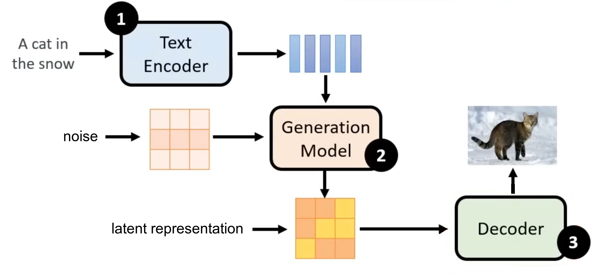
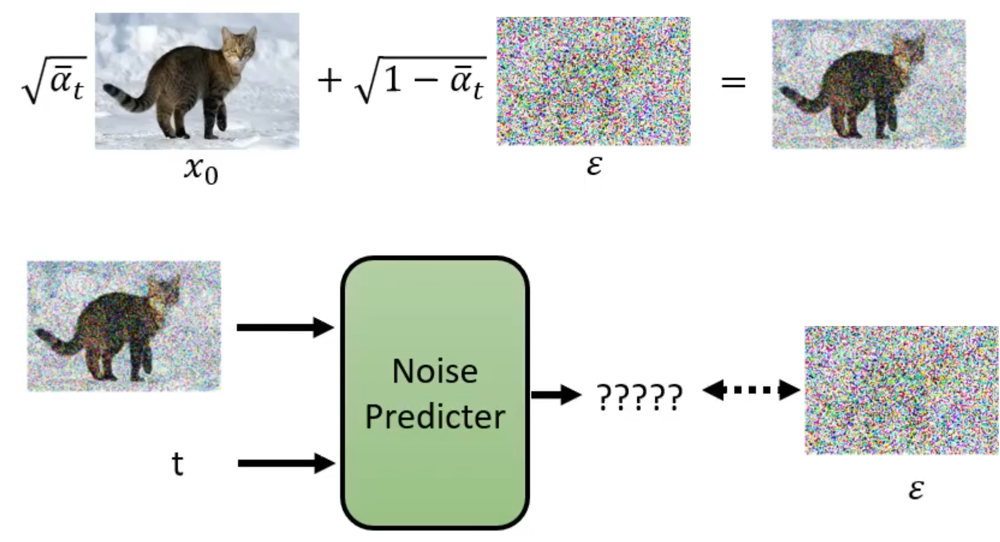
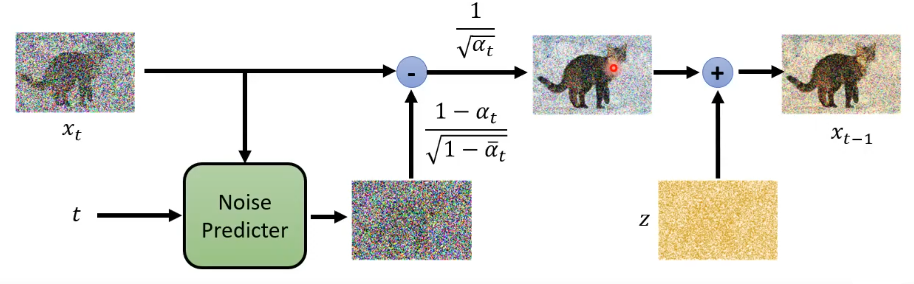
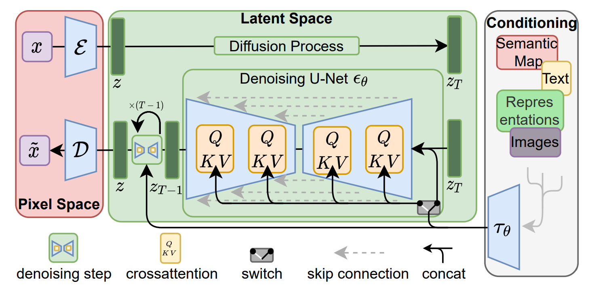
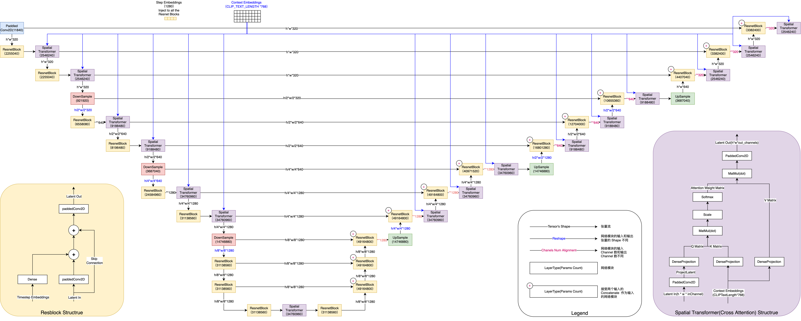
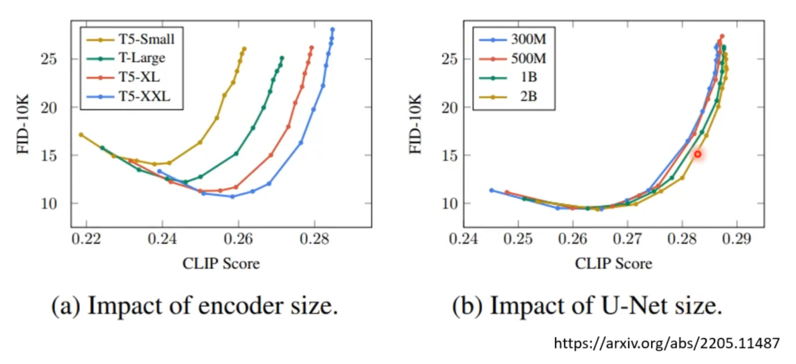

### framework

The generation model denoises the initial noise (which is sampled from normal distribution) by multiple iterations, conditioned by the latent context embeddings encoded by the encoder, and ultimately producing the latent representation. The latent representation is then decoded to image. 

Note that <b>the whole denoising process is carried out in the latent space</b>. The final latent representation is then be decoded to the pixel space.

### mechanism

#### training:

$$
\begin{array}{l}
\hline
\textbf{Algorithm 1} \text{ Training} \\
\hline
1: \textbf{repeat} \\
2: \quad \mathbf{x}_0 \sim q(\mathbf{x}_0) \\
3: \quad t \sim \text{Uniform}(\{1, \dots, T\}) \\
4: \quad \epsilon \sim \mathcal{N}(\mathbf{0}, \mathbf{I}) \\
5: \quad \text{Take gradient descent step on} \\
\qquad \nabla_\theta \left\| \epsilon - \epsilon_\theta \left( \sqrt{\bar{\alpha}_t} \mathbf{x}_0 + \sqrt{1 - \bar{\alpha}_t} \epsilon, t \right) \right\|^2 \\
6: \textbf{until} \text{ converged} \\
\hline
\end{array}
$$

where

-  $q(\mathbf{x}_0)$ is the input image distribution.

- $\bar{\alpha}_1, \dots, \bar{\alpha}_T$ is a set of hyperparameters and $\bar{\alpha}_1< \dots< \bar{\alpha}_T$.
- $\epsilon_\theta$ is the noise predictor.

#### inference:

$$
\begin{array}{l}
\hline
\textbf{Algorithm 2} \text{ Sampling} \\
\hline
1: \mathbf{x}_T \sim \mathcal{N}(\mathbf{0}, \mathbf{I}) \\
2: \textbf{for } t = T, \dots, 1 \textbf{ do} \\
3: \quad \mathbf{z} \sim \mathcal{N}(\mathbf{0}, \mathbf{I}) \text{ if } t > 1, \text{ else } \mathbf{z} = \mathbf{0} \\
4: \quad \mathbf{x}_{t-1} = \frac{1}{\sqrt{\alpha_t}} \left( \mathbf{x}_t - \frac{1 - \alpha_t}{\sqrt{1 - \bar{\alpha}_t}} \epsilon_\theta(\mathbf{x}_t, t) \right) + \sigma_t \mathbf{z} \\
5: \textbf{end for} \\
6: \textbf{return } \mathbf{x}_0 \\
\hline
\end{array}
$$

where

- $\beta_t$ is a pre-defined small numerical value (e.g. ranging from 0.0001 to 0.02). It represents the proportion of noise to be newly added to the image at step $t$.
- $\alpha_t = 1-\beta_t$ is the *single-step retention*, signifying the signal retained after a single diffusion step.

- $$\bar{\alpha}_t = \prod_{s=1}^t \alpha_s = \alpha_1 \times \alpha_2 \times \dots \times \alpha_t$$ is the *cumulative retention*, signifying the total signal retained so far at step $t$.

Why adding $\sigma_t \mathbf{z}$?

- To Enable Generative Diversity

  Without this noise, the reverse process becomes deterministic. If you input the same initial random noise ($x_T$), the math would produce the exact same image every single time. Adding $\sigma_t \mathbf{z}$ injects randomness at every step, allowing the model to explore slightly different paths and generate diverse variations of the image.

- To Prevent Blurry Images (Mode Collapse)

  The neural network predicts the mean (average) of the data distribution.

  - If you only keep the mean (remove the noise), the model will average out all possible high-frequency details (like hair, fur, or texture), resulting in a smooth, <b>blurry</b> look.
  - Adding noise forces the model to move away from the safe "average" and commit to specific, sharp details.
  - To Perform True Sampling

  Mathematically, the reverse diffusion step is a probability distribution (Gaussian), not a single number.

  - The formula $\mu_\theta$ gives us the center of that distribution.
  - The term $\sigma_t \mathbf{z}$ allows us to mathematically sample a random point from that distribution, rather than just taking the center point.

- In short: It turns the process from a calculation (which outputs a blurry average) into a simulation (which outputs a sharp, specific instance).

> **Core Idea:** Adding autoregressive method (i.e. denoising iteratively in diffusion policies) in non-autoregressive tasks (i.e. image generation in contrast to language generation) to take advantages of both.

### Stable Diffusion

Given an image $x ∈ \Bbb{R}^{H×W×3}$ in RGB space, the encoder $\cal{E} $ encodes $x$ into a latent representation $z = \cal{E}(x)$, and the decoder $\cal{D}$ reconstructs the image from the latent, giving $\tilde{x} = \cal{D} (z) = \cal{D}(E(x))$, where $z ∈ \Bbb{R}^{h×w×c}$ .

To pre-process $y$ from various modalities (such as language prompts) we introduce a domain specific encoder $τ_θ$ that projects $y$ to an intermediate representation $τ_θ(y) ∈ \Bbb{R}^{M×d_τ} $, which is then mapped to the intermediate layers of the UNet via a cross-attention layer.

#### Denoising U-Net $\varepsilon_\theta$:

- <b>Dense/DenseProjection:</b> i.e. Linear/LinearProjection
- <b>paddedConv2D: </b>When the kernel scanning an image, edge pixels cannot be fully convolved due to incomplete coverage, resulting in a one-pixel reduction in the output image dimension on all sides (e.g. \( 64 \times 64 \) input $\rightarrow$ \( 62 \times 62 \) output). *Padding* involves appending a border of zeros around the original latent matrix, thus ensuring that the input spatial dimensions match the output spatial dimensions.
- <b>channels: </b>i.e. Dimension of features of each pixel. e.g. for the input image, *channel* = 3 (i.e. R, G, B); for the latent matrix, *channel* may increase to 1280. Because for each *ResnetBlock*, the convolution operation is performed by multiple kernels, the *feature maps* produced by each kernel are stacked together, thus resulting extra dimensions added after each convolution. (i.e. $1280 = \text{(num\_kernal)}_1 \times \cdots \times\text{(num\_kernal)}_n$)

#### Encoder:

Researches showed that larger encoder size significantly improves model performance, while increasing the size of generation model does not yield a significant improvement in performance. 

### Flow-based Model

