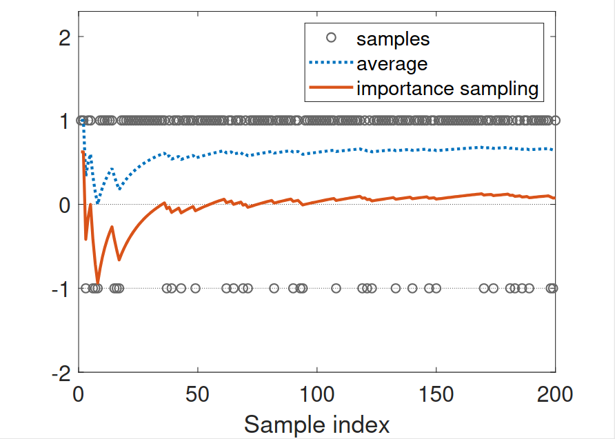

# Math Foundation RL

## Basic Concepts

Discount Rate $\gamma$ :

- $\gamma$ is close to 0 $\rightarrow$ the *discounted return* is dominated by the rewards from the  near future
- $\gamma$ is close to 1 $\rightarrow$  dominated by the rewards from the far future

An *episode* is usually assumed to be *finite* *trajectory* (i.e. the agent stops at some *terminal states*). Task with episodes are called *episodic tasks*.

A positive reward represents encouragement to take such actions, a negative reward represents punishment to take such actions.

Converting episodic tasks to continuing tasks:

- Option 1: Treat the target state as a special *absorbing state*. Once the agent reaches an absorbing state, it will never leave and the consequent rewards $r = 0$.
- **Option 2:** Treat the target state as a normal state with a policy. The agent can still leave the target state and gain $r = +1$ when entering the target afterwards.

### MDP: Markov Decision Process

Sets:

- State: the set of states $S$.

-  Action: the set of actions $A(s)$ is associated for state $s \in S$.

- Reward: the set of rewards $R(s, a)$.

Probability distribution (or called *system model*):

- State transition probability: at state $s$, taking action $a$, the probability to
    transit to state $s'$ is $p(s' |s, a)$.
- Reward probability: at state $s$, taking action $a$, the probability to get
    reward $r$ is $p(r|s, a)$.

Policy: at state $s$, the probability to choose action $a$ is $\pi (a|s)$.

Markov property: memoryless property

## Bellman Equation

### State Value

> The value of one state relies on the values of other states ——*Bootstrapping*

$$
\displaylines{
{\bf{trajectory : \ }} S_t \xrightarrow{A_t} R_{t+1}, S_{t+1} \xrightarrow{A_{t+1}} R_{t+2}, S_{t+2} \xrightarrow{A_{t+2}} R_{t+3}, S_{t+3}, \xrightarrow{A_{t+3}} \cdots \\
\begin{align}
{\bf{discounted \ return: \ }}G_t &= R_{t+1} + \gamma R_{t+2} + \gamma^2 R_{t+3} + \cdots  = R_{t+1} + \gamma G_{t+1} \\
{\bf{state \ value: \ }}v_{\pi}(s) &= \Bbb{E}[G_t | S_t=s] \\
&= \Bbb{E}[R_{t+1} + \gamma G_{t+1} | S_t=s] \\
&= \Bbb{E}[R_{t+1} | S_t=s] + \gamma\Bbb{E}[G_{t+1} | S_t=s]
\end{align}
}
$$

First term of RHS (i.e. expectation of *immediate rewards*):
$$
\begin{align}
\Bbb{E}[R_{t+1} | S_t=s] &= \sum_{a}\pi(a|s)\Bbb{E}[R_{t+1}|S_t=a,A_t=a] \\
&=\sum_{a}\pi(a|s)\sum_{r}p(r|s,a)r \\
&\overset{\Delta}{=}r_{\pi}(s) \tag{1}
\end{align}
$$
Second term of RHS (i.e. expectation of *future rewards*):
$$
\begin{align}
\Bbb{E}[G_{t+1} | S_t=s] &= \sum_{s'}\Bbb{E}[G_{t+1}|S_{t+1}=s']p(s'|s) \\
&=\sum_{s'}v_{\pi}(s')p(s'|s) \\
&=\sum_{s'}v_{\pi}(s')\sum_{a}p(s'|s,a)\pi(a|s) \overset{\Delta}{=}\sum_{s'}v_{\pi}(s')p_{\pi}(s'|s) \tag{2}\\
&=\sum_{a}\pi(a|s)\sum_{s'}p(s'|s,a)v_{\pi}(s') \\
\end{align}
$$
### Bellman Equation

Therefore the $\bf{Bellman \ Equation}$ can conclude from (1) and (2):
$$
\begin{align}
v_{\pi}(s) &=\sum_{a}\pi(a|s)\left[\sum_{r}p(r|s,a)r+\gamma \sum_{s'}v_{\pi}(s')p(s'|s,a)\right] \tag{3} \\
&= r_{\pi}(s) +\gamma \sum_{s'}v_{\pi}(s')p_{\pi}(s'|s) \\
&= r _ { \pi } \left( s _ { i } \right) + \gamma \sum _ { s _ { j } } p _ { \pi } \left( s _ { j }|s _ { i } \right) v _ { \pi } \left( s _ { j } \right) ;   \\
& \text{Suppose the states could be indexed as}\  s_i \ (i = 1, . . . , n).
\end{align}
$$
Matrix-vector form of $\bf{Bellman \ Equation}$:
$$
v _ { \pi } = r _ { \pi } + \gamma P _ { \pi } v _ { \pi }
$$

where

$$v _ { \pi } = \left[ v _ { \pi } \left( s _ { 1 } \right) , \ldots , v _ { \pi } \left( s _ { n } \right) \right] ^ { T } \in \mathbb { R } ^ { n }$$ 
$$r _ { \pi } = \left[ r _ { \pi } \left( s _ { 1 } \right) , \ldots , r _ { \pi } \left( s _ { n } \right) \right] ^ { T } \in \mathbb { R } ^ { n }$$
$P _ { \pi } \in \mathbb { R } ^ { n \times n }$, where $\left[ P _ { \pi } \right] _ { i j } = p _ { \pi } \left( s _ { j } \mid s _ { i } \right)$ is the *state transition matrix*

example: 
$$
\underbrace{
  \begin{bmatrix}
  v_\pi(s_1) \\
  v_\pi(s_2) \\
  v_\pi(s_3) \\
  v_\pi(s_4)
  \end{bmatrix}
}_{v_\pi}
=
\underbrace{
  \begin{bmatrix}
  r_\pi(s_1) \\
  r_\pi(s_2) \\
  r_\pi(s_3) \\
  r_\pi(s_4)
  \end{bmatrix}
}_{r_\pi}
+ \gamma
\underbrace{
  \begin{bmatrix}
  p_\pi(s_1|s_1) & p_\pi(s_2|s_1) & p_\pi(s_3|s_1) & p_\pi(s_4|s_1) \\
  p_\pi(s_1|s_2) & p_\pi(s_2|s_2) & p_\pi(s_3|s_2) & p_\pi(s_4|s_2) \\
  p_\pi(s_1|s_3) & p_\pi(s_2|s_3) & p_\pi(s_3|s_3) & p_\pi(s_4|s_3) \\
  p_\pi(s_1|s_4) & p_\pi(s_2|s_4) & p_\pi(s_3|s_4) & p_\pi(s_4|s_4)
  \end{bmatrix}
}_{P_\pi}
\underbrace{
  \begin{bmatrix}
  v_\pi(s_1) \\
  v_\pi(s_2) \\
  v_\pi(s_3) \\
  v_\pi(s_4)
  \end{bmatrix}
}_{v_\pi}
$$

Solve the value via iterative solution:
$$
v _ { k+1 } = r _ { \pi } + \gamma P _ { \pi } v _ { k } \\
v_k \rightarrow v_{\pi},\quad k \rightarrow \infty
$$

### Action Value

$$
q _ { \pi } ( s , a ) = \mathbb { E } \left[ G _ { t } | S _ { t } = s , A _ { t } = a \right]
$$

Conclude from (3) that:
$$
\begin{align}
v_{\pi}(s) &= \Bbb{E}[G_t | S_t=s] \\
&=\sum_{a}\mathbb { E } \left[ G _ { t } | S _ { t } = s , A _ { t } = a \right]\pi(a|s) \\
&=\sum_{a}\pi(a|s) \underbrace{ \left[\sum_{r}p(r|s,a)r+\gamma \sum_{s'}v_{\pi}(s')p(s'|s,a)\right] }_{q_\pi(s,a)} \\
\end{align}
$$
Hence,
$$
\begin{align}
v_{\pi}(s) &= \sum_{a}\pi(a|s) q_\pi(s,a) \tag{4} \\
q_\pi(s,a) &= \sum_{r}p(r|s,a)r+\gamma \sum_{s'}v_{\pi}(s')p(s'|s,a) \tag{5}
\end{align}
$$
(4) and (5) are the two sides of the same coin:

- (4) shows how to obtain *state values* from *action values*.
- (5) shows how to obtain *action values* from *state values* .

## BOE: Bellman Optimality Equation

### Intro

Evaluating whether a policy is good: if
$$
v_{\pi 1}(s) \geqslant v_{\pi 2}(s) \quad \text{for all } s \in \cal{S}
$$
then $\pi_1$ is better than $\pi_2$.

Therefore a policy $\pi ^*$ is optimal if $v_{\pi ^*}(s) \geqslant v_{\pi}(s)$ for all $s$ and for any other policy $\pi$.

$\bf{Bellman\ Optimality \ Equation}$ (elementwise form):
$$
\begin{align}
v(s) &=\max _ { \pi } 
\sum_{a}\pi(a|s)\left[\sum_{r}p(r|s,a)r+\gamma \sum_{s'}v(s')p(s'|s,a)\right], \quad s \in \cal{S} \\
&= \max _ { \pi }\sum_{a}\pi(a|s) q(s,a), \quad s \in \cal{S}
\end{align}
$$
**This equation shows how the state values (LHS) achieves its maximum (RHS) which corresponds to the optimal policy.**

Remarks:

- $p(r|s,a)$, $p(s'|s,a)$, $r$, $\gamma$ are known $\rightarrow$ $q(s,a)$ depends on $v(s')$.
- $v(s)$, $v(s')$ are unknown and to be calculated.
- The goal is to solve the equation to find the optimal policy $\pi ^*$.

$\bf{Bellman\ Optimality \ Equation}$ (matrix-vector form):
$$
v =\max _ { \pi }( r _ { \pi } + \gamma P _ { \pi } v)
$$
### How to Solve

- Maximize the RHS expression elementwisely：
  $$
  \max _ { \pi }\sum_{a}\pi(a|s) q(s,a) \\
  \leqslant \max_{a \in \cal{A} (s)}q(s,a) = q ( s , a ^* )
  $$
  where the optimality is achieved when
  $$
  \pi ( a | s ) = \left\{ \begin{array} { c c } 1 & a = a ^ { * } \\ 0 & a \neq a ^ { * } \end{array} \right. \quad where  \ a ^ { * } = \arg \max _ { a } q ( s , a )
  $$
  This is because the RHS expression is actually the weighted sum of all possible $q ( s , a )$ given a specific $s$. Since the weights (i.e. the possibility $\pi ( a | s )$ for all $a$) adds up to 1, we just need to put all the weights on the largest $q ( s , a )$ (i.e. assign the probability of 1 to $q ( s , a ^ * )$, and 0 to the rest $q ( s , a )$) to achieve the maximum.

- As for the matrix-vector form, rewrite BOE as: $v =\max _ { \pi }( r _ { \pi } + \gamma P _ { \pi } v) \overset{\Delta}{=} f(v)$

- According to *Contraction Mapping Theorem*，BOE is a *contraction mapping* with a unique  *fixed point* $v^*$. 

  According  to *value iteration algorithm*, the solution of BOE could be solved iteratively by 
  $$
  v_{k+1} = f(v_k) = \max _ { \pi }( r _ { \pi } + \gamma P _ { \pi } v_k)
  $$
  This sequence ${v_k }$ converges to $v ^∗$ exponentially fast given any initial guess $v_0$ . The convergence rate is determined by $\gamma$.

- Suppose 

  $$
  \pi ^{ \ast } = \arg \max \limits_{\pi }\left(r_{\pi } + \gamma P_{\pi }v^{ \ast }\right. )
  $$

  Then 
  $$
  v ^{ \ast } = r_{\pi^* } + \gamma P_{\pi^* }v^{ \ast }
  $$
  Therefore, $π ^∗$ is a policy and $v ^∗ = v_{π^∗}$ is the corresponding state value.

- It can be proved mathematically that for the *fixed point* $v^*$,
  $$
  v^* \geqslant v_\pi, \quad \forall \pi
  $$
  therefore $\pi ^*$ is the optimal policy. It is a *deterministic greedy policy* as below:
  $$
  \pi ( a | s ) = \left\{ \begin{array} { c c } 1 & a = a ^ { * } \\ 0 & a \neq a ^ { * } \end{array} \right.
  $$
  where $\ a ^ { * } = \arg \max _ { a } q^* ( s , a )$ and $q^* ( s , a )$ corresponds to $v^*(a)$.

> The optimal policies are invariant to the linear transformation of the reward signals.

## Truncated Policy Iteration Algorithm

*Pseudocode:*

<b>Initialization:</b> The probability model $p(r|s,a)$ and $p(s'|s,a)$ for all $(s,a)$ are known.

<b>Aim:</b> Search for the optimal state value and an optimal policy.

<b>While</b> $v_k$ has not converged, <b>for</b> the $k$th iteration $(k = 0, 1, 2, . . . )$, <b>do</b>

​&emsp;&emsp;*Policy evaluation:*

&emsp;&emsp;<b>Initialization:</b> select the initial guess as $v_k^{(0)}=v_{k-1}$. The maximum iteration is set to be $j_{truncate}$.

​&emsp;&emsp;<b>While</b> $j < j_{truncate}$, <b>do</b>

&emsp;&emsp;&emsp;&emsp;<b>For</b> every state $s \in \cal{S}$, <b>do</b>

​&emsp;&emsp;&emsp;&emsp;&emsp;&emsp;$v_{k}^{(j + 1)}(s) = \sum _{a}\pi _{k}(a | s)\left[\sum _{r}p(r | s,a)⁢⁢r + \gamma \sum _{s^{′}}p(s^{′} | s,a)v_{k}^{(j)}(s^{′})\right]$

&emsp;&emsp;<b>Set</b> $v_k = v_k ^{(j_{truncate})}$  *# Note that when $j \rightarrow \infty$, $v_k ^{(j)}$ converges to $v_{\pi_k}$ of current $\pi_k$*

​							        *# and it can be proved mathematically that for any iteration $j$，$v_k^{j-1}<v_k^j<v_k^{j_{truncate}}$.*

​							        *# S.t. $v_{\pi_k}$ is taken as the evaluation of  $\pi_k$, and we improve $\pi_k$ based on $v_{\pi_k}$.*

​							        *# For computational efficiency, only iterate over $j < j_{truncate}$*

​							        *# because $v_k ^{(j_{truncate})}$ is close enough to $v_{\pi_k}$.* 

​&emsp;&emsp;*Policy improvement:*

&emsp;&emsp;<b>For</b> every state $s \in \cal{S}$, <b>do</b>

&emsp;&emsp;&emsp;&emsp;<b>For</b> every action $a \in \cal{A}(s)$, <b>do</b>

​&emsp;&emsp;&emsp;&emsp;&emsp;&emsp;$q_{k}(s,a) = \sum _{r}p(r | s,a)⁢⁢r + \gamma \sum _{s^{′}}p(s^{′} | s,a)v_{k}(s^{′})$

​&emsp;&emsp;&emsp;&emsp;$a_k^*(s) = \arg \max \limits_{a} q_k(s,a)$

​&emsp;&emsp;&emsp;&emsp;$\pi_{k+1}(a|s) = 1$ if $a=a_k^*$, and $\pi_{k+1}(a|s) = 0$ otherwise

​							    *# Lemma: If $\pi_{k+1}=\arg \max \limits_{\pi }\left(r_{\pi } + \gamma P_{\pi }v_{\pi_k}\right. )$ then $v_{\pi_{k} }<v_{\pi_{k+1} }$ for any $k$.* 

​							    *# Theorem: The state value generated by the iteration converges to the optimal state value $v^{\ast}$,*

​							    *# as a result, the policy converges to an optimal policy.* 

---

The case of $j_{truncate} = 1$ is *Value Iteration Algorithm*, and the case of $j_{truncate} = \infty$ is *Policy Iteration Algorithm*.

## MC: Monte Carlo Learning

> model-free RL: When model is unavailable, we can use data.

### MC Basic algorithm

> Many model-based and model-free RL algorithms fall into this framework.

---

*Pseudocode:*

<b>Initialization: </b>Initial guess $\pi_0$.
<b>Aim:</b> Search for an optimal policy.

<b>For</b> the $k$th iteration $(k = 0, 1, 2, . . . )$, <b>do</b>

​&emsp;&emsp;<b>For</b> every state $s \in \cal{S}$, <b>do</b>

​&emsp;&emsp;&emsp;&emsp;Collect sufficiently many episodes starting from $(s,a)$ following $\pi_k$

​&emsp;&emsp;&emsp;&emsp;*Policy evaluation:*

​&emsp;&emsp;&emsp;&emsp;$q_{\pi_k}(s, a) \approx q_k(s,a)=$ average return of all the episodes starting from $(s,a)$

​&emsp;&emsp;*Policy improvement:*

​&emsp;&emsp;$a_k^*(s) = \arg \max \limits_{a} q_k(s,a)$

​&emsp;&emsp;$\pi_{k+1}(a|s) = 1$ if $a=a_k^*$, and $\pi_{k+1}(a|s) = 0$ otherwise

---

Since policy iteration is convergent, the convergence of MC Basic is also guaranteed to be convergent given sufficient episodes.

Episode length:

- When the episode length is short, only the states that are close to the target have nonzero state values.
- As the episode length increases, the states that are closer to the target have nonzero values earlier than those farther away.
- The episode length should be sufficiently long, but does not have to be infinitely long.

<b>Visit:</b> every time a state-action pair appears in the episode, it is called a visit of that state-action pair.

For an episode such as:
$$
s_1 \xrightarrow{a_2} s_2 \xrightarrow{a_4} s_1 \xrightarrow{a_2} s_2 \xrightarrow{a_3} s_5 \xrightarrow{a_1} \dots
$$
Methods to approximate $q_{\pi_k}(s, a)$ using the data: 

- <b>Initial-visit method:</b> Just calculate the return and approximate $q_\pi(s_1, a_2)$.

- <b>Every-visit method:</b> 
  $$
  \begin{align*}
  s_1 \xrightarrow{a_2} s_2 \xrightarrow{a_4} s_1 \xrightarrow{a_2} s_2 \xrightarrow{a_3} s_5 \xrightarrow{a_1} \dots & \quad \text{[original episode]} \\
  \phantom{s_1 \xrightarrow{a_2}} s_2 \xrightarrow{a_4} s_1 \xrightarrow{a_2} s_2 \xrightarrow{a_3} s_5 \xrightarrow{a_1} \dots & \quad \text{[episode starting from } (s_2, a_4)\text{]} \\
  \phantom{s_1 \xrightarrow{a_2} s_2 \xrightarrow{a_4}} s_1 \xrightarrow{a_2} s_2 \xrightarrow{a_3} s_5 \xrightarrow{a_1} \dots & \quad \text{[episode starting from } (s_1, a_2)\text{]} \\
  \phantom{s_1 \xrightarrow{a_2} s_2 \xrightarrow{a_4} s_1 \xrightarrow{a_2}} s_2 \xrightarrow{a_3} s_5 \xrightarrow{a_1} \dots & \quad \text{[episode starting from } (s_2, a_3)\text{]} \\
  \phantom{s_1 \xrightarrow{a_2} s_2 \xrightarrow{a_4} s_1 \xrightarrow{a_2} s_2 \xrightarrow{a_3}} s_5 \xrightarrow{a_1} \dots & \quad \text{[episode starting from } (s_5, a_1)\text{]}
  \end{align*}
  $$

  Can estimate $q _ { \pi } \left( s _ { 1 } , a _ { 2 } \right) , q _ { \pi } \left( s _ { 2 } , a _ { 4 } \right) , q _ { \pi } \left( s _ { 2 } , a _ { 3 } \right) , q _ { \pi } \left( s _ { 5 } , a _ { 1 } \right) , \ldots$

When to update the policy:

- Low efficiency: In the policy evaluation step, to collect all the episodes starting from a state-action pair and then use the average return to approximate the action value.
- High efficiency: Uses the return of a single episode to approximate the action value. In this way, we can improve the policy episode-by-episode.
- Will the second method cause problems? 
  - In fact, we have applied its idea in the truncated policy iteration algorithm (i.e. approximating $v_{\pi_k}$ via limited iterations). 
  - Even if using the single episode we sampled as $q(s,a)$ is imprecise,  as long as the relative values of $q(s,a)$ for different $a$ are roughly correct, the policy still selects the action with higher return in $\arg \max \limits_{a} q_k(s,a)$, thus improving on the right track.
  - When the policy gets better, **it generates episodes that are closer to the optimal trajectory, and consequently less random (i.e. the variance of $q_k(s,a)$ gets smaller and thus $q_k(s,a)$ converges to $q_{\pi_k}(s, a)$ continuously)**.

### MC Exploring Starts

---

*Pseudocode:*

<b>Initialization: </b> Initial policy $\pi_0(a|s)$ and initial value $q(s,a)$ for all $(s,a)$. $Returns(s,a) = [ \ ]$ for all $(s,a)$.

<b>Aim:</b> Search for an optimal policy.

<b>For</b> each episode, <b>do</b>

​&emsp;&emsp;*Episode generation:* Select a starting state-action pair $(s_0, a_0)$ and ensure that all pairs can be possibly selected as starting point (this is the exploring-starts condition). Following the current policy, generate an episode of length $T$: $s_0, a_0,r_1, ..., s_{T-1}, a_{T-1},r_{T}$.

​&emsp;&emsp;<b>Initialization</b> for each episode: $g \leftarrow 0$

&emsp;&emsp;<b>For</b> each step of the episode, $t = T-1, T-2, ... , 0$, <b>do</b>	*# Compute reversely from the end of the episode.*

​&emsp;&emsp;&emsp;&emsp;$g \leftarrow \gamma g + r_{t+1}$							         	*#  S.t. only need one step of calculation for each update of $g$.*

​&emsp;&emsp;&emsp;&emsp;$Returns(s_t, a_t) \leftarrow Returns(s_t,a_t) \cup \{g\}$

​&emsp;&emsp;&emsp;&emsp;*Policy evaluation:*

​&emsp;&emsp;&emsp;&emsp;$q(s_t,a_t) \leftarrow$ average($Returns(s_t,a_t)$)

​&emsp;&emsp;&emsp;&emsp;*Policy improvement:*

​&emsp;&emsp;&emsp;&emsp;$\pi(a|s_t) = 1$ if $a=\arg \max \limits_{a} q(s_t, a)$, and $\pi(a|s_t) = 0$ otherwise

---

> What is exploring starts? Exploring starts means we need to generate sufficiently many episodes $\underbrace{starting}_{starts}$ from $\underbrace{every}_{exploring}$ state-action pair.

In theory, only if every action value for every state is well explored, can we select the optimal actions correctly. Otherwise, if an action is not explored, this action may happen to be the optimal one and hence be missed.

### MC $\varepsilon$-Greedy

> What is a soft policy? A policy is *soft* if the probability to take any action is positive. With a soft policy, a few episodes that are sufficiently long can visit every state-action pair. 
>
> Then, we do not need to have a large number of episodes starting from every state-action pair. Hence, the requirement of exploring starts can be removed.
>
> - Deterministic policy: e.g. greedy policy
> - Stochastic policy: e.g. soft policy

---

*Pseudocode:*

<b>Initialization: </b> Initial policy $\pi_0(a|s)$ and initial value $q(s,a)$ for all $(s,a)$. $Returns(s,a) = [ \ ]$ for all $(s,a)$. $\varepsilon \in (0,1]$.

<b>Aim:</b> Search for the optimal state value and an optimal policy.

<b>For</b> each episode, <b>do</b>

​&emsp;&emsp;*Episode generation:* Select a starting state-action pair $(s_0, a_0)$ (the exploring-starts condition is not required). Following the current policy, generate an episode of length $T$: $s_0, a_0,r_1, ..., s_{T-1}, a_{T-1},r_{T}$.

​&emsp;&emsp;<b>Initialization</b> for each episode: $g \leftarrow 0$

​&emsp;&emsp;<b>For</b> each step of the episode, $t = T-1, T-2, ... , 0$, <b>do</b>

​&emsp;&emsp;&emsp;&emsp;$g \leftarrow \gamma g + r_{t+1}$

​&emsp;&emsp;&emsp;&emsp;$Returns(s_t, a_t) \leftarrow Returns(s_t,a_t) \cup \{g\}$

​&emsp;&emsp;&emsp;&emsp;*Policy evaluation:*

​&emsp;&emsp;&emsp;&emsp;$q(s_t,a_t) \leftarrow$ average($Returns(s_t,a_t)$)

&emsp;&emsp;&emsp;&emsp;*Policy improvement:*		

​&emsp;&emsp;&emsp;&emsp;Let $a^*=\arg \max \limits_{a} q(s_t, a)$ and 
$$
\pi ( a | s _ { t } ) = \left\{ \begin{array} { c c } 1 - \frac { \left| \mathcal { A } \left( s _ { t } \right) \right| - 1 } { \left| \mathcal { A } \left( s _ { t } \right) \right| } \epsilon , & \text{for the greedy action} \\ \frac { 1 } { \left| \mathcal { A } \left( s _ { t } \right) \right| } \epsilon , & \text{fot the other } |\cal{A}\left(s\right)|-1 \text{ actions} \end{array} \right.
$$

---

$\varepsilon$ controls the balance between <b>exploration</b> and <b>exploitation</b>.

The advantage of $ε$-greedy policies is that they have strong exploration ability when $ε$ is large.

The disadvantage is that $ε$-greedy polices are not optimal in general.

- $ε$ cannot be too large. We can also use a decaying $ε$.

## SA: Stochastic Approximation

SA refers to a broad class of stochastic iterative algorithms solving root finding or optimization problems.

Compared to many other root-finding algorithms such as gradient-based methods, SA is powerful in the sense that it <b>does not require to know the expression of the objective function nor its derivative</b> (model-free).

### Robbins-Monro algorithm

<b>Problem statement:</b> Suppose we would like to find the root of the equation
$$
g(w)=0
$$
The <b>Robbins-Monro (RM) algorithm</b> that can solve this problem is as follows:
$$
w _ { k + 1 } = w _ { k } - a _ { k } \tilde { g } ( w _ { k } , \eta _ { k } ) , \quad k = 1 , 2 , 3 , \ldots
$$
where

- $w_k$ is the $k$th estimate of the root

- $\tilde { g } ( w _ { k } , \eta _ { k } ) = g(w_k)+\eta_k$ is the $k$th noisy observation

- $a_k$ is a positive coefficient.

The function $g(w)$ is viewed as a black box, for which only the input sequence $\{w_k\}$ and output sequence (noisy) $\{\tilde { g } ( w _ { k } , \eta _ { k } ) \}$ are available. So this algorithm relies on data instead of model.

><b>Robbins-Monro Theorem</b>
In the Robbins-Monro algorithm, if
>1.  $0 < c _ { 1 } \leq \nabla _ { w } g ( w ) \leq c _ { 2 }$ for all $w$; 
>2.  $\sum _ { k = 1 } ^ { \infty } a _ { k } = \infty$ and $\sum _ { k = 1 } ^ { \infty } a _ { k } ^ { 2 } < \infty$; 
>3.  $\mathbb { E } \left[ \eta _ { k } | \mathcal { H } _ { k } \right] = 0$ and $\mathbb { E } \left[ \eta _ { k } ^ { 2 } \mid \mathcal { H } _ { k } \right] < \infty ;$ 
>where $$\mathcal { H } _ { k } = \left\{ w _ { k } , w _ { k - 1 } , \ldots \right\},$$
>
then $w_k$  converges w.p.1 to the root $w^*$ satisfying $g(w^*) = 0$.

Explanations of the three conditions:

- Condition1：
  - $g$ should be monotonically increasing, which ensures that the root of $g(w) = 0$ exists and is unique.
  - This condition requires that $g(w)$ is convex.

- Condition 2:

  - $\sum _ { k = 1 } ^ { \infty } a _ { k }^2 < \infty$ ensures that $a_k$ converges to zero as $k \rightarrow \infty$, so $w_k$ converges to $w^*$  as well. 

    Also, if $w _ { k } \rightarrow w ^ { * } , g ( w _ { k } ) \rightarrow 0$ and $\tilde { g } ( w _ { k } , \eta _ { k } )$ is dominant by $\eta _ { k }$. This randomness should be limited.

  - $\sum _ { k = 1 } ^ { \infty } a _ { k } = \infty$ ensures that $a_k$ do not converge to zero too fast. Otherwise  $a_k$ might converge to zero too early when there is still quite a distance between $w_k$ and $w^*$, and in this case $w_k$ is not able to get closer to $w^*$.

- Condition 3: The noise should be unbiased and its variance should be limited.

### BGD, SGD, MBGD

<b>Problem setup:</b> Suppose we aim to solve the following optimization problem:
$$
\min _ { w }  J ( w ) = \mathbb { E } [ f ( w , X ) ]
$$

- $w$ is the parameter to be optimized.
- $X$ is a random variable. The expectation is with respect to $X$.
- $w$ and $X$ can be either scalars or vectors. The function $f (·)$ is a scalar.

The *Batch Gradient Descent*, *Stochastic Gradient Descent*, *Mini-batch Gradient Descent* algorithms solving this problem are, respectively,
$$
w _ { k + 1 } = w _ { k } - \alpha _ { k } \underbrace{\frac { 1 } { n } \sum _ { i = 1 } ^ { n } \nabla _ { w } f ( w _ { k } , x _ { i } )}_{\approx  \mathbb { E } \left[ \nabla _ { w } f \left( w _ { k } , X \right) \right] } , \quad\quad (BGD) \\
$$
All the samples are used in every iteration, so the approximation to the true gradient $\mathbb { E } \left[ \nabla _ { w } f \left( w _ { k } , X \right) \right]$ is close.
$$
w _ { k + 1 } = w _ { k } - \alpha _ { k } \underbrace{\frac { 1 } { m } \sum _ { j \in \mathcal { I } _ { k } } \nabla _ { w } f ( w _ { k } , x _ { j } ) }_{\approx  \mathbb { E } \left[ \nabla _ { w } f \left( w _ { k } , X \right) \right] }, \quad\quad(MBGD) \\
$$
$\cal{I}_k$ is a subset of $\{1, . . . , n\}$ with the size $|\cal{I}_k | = m$. The set  $\cal{I}_k$ is obtained by $m$ times idd samplings.
$$
w _ { k + 1 } = w _ { k } - \alpha _ { k } \nabla _ { w } f ( w _ { k } , x _ { k } ). \quad\quad (SGD)
$$

## TD: Temporal Difference Learning

Problem statement:

- Given policy $\pi$, the aim is to estimate the state values $\{v_\pi (s)\}_{s\in S}$ <b>under $\pi$</b>.

<b>The TD learning algorithm is</b>
$$
\begin{align}
\underbrace{v_{t + 1}(s_{t})}_{new \ estimate} &= \underbrace{v_{t}(s_{t})}_{current \ estimate}−\alpha _{t}(s_{t})\underbrace{[v_{t}(s_{t})−[\overbrace{ r_{t + 1} + \gamma v_{t}(s_{t + 1})}^{TD \ target \ \bar{v}_t}]}_{TD \ error \ \delta_t } \tag{1}\\
v _ { t + 1 } ( s ) &= v _ { t } ( s ) , \quad \forall s \neq s _ { t } , \tag{2}
\end{align}
$$
where $t = 0,1,2,...$

- Here, $v_t (s_t )$ is the estimated state value of $v_\pi (s_t )$; $\alpha_t (s_t )$ is the learning rate of $s_t$ at time $t$.
- At time $t$, only the value of the visited state $s_t$ is updated whereas the values of the unvisited states $s \neq  s_t$ remain unchanged.
- The update in $(2)$ will be omitted when the context is clear.

Observation: The new estimate $v_{t + 1}(s_{t})$ is a combination of the current estimate $v_{t}(s_{t})$ and the TD error.

- Interpretation of *TD target $\bar{v}_t$*: $v_{t}(s_{t})$ is the estimate for state value at $s_t$ before taking the action $a_t$. At $s_{t+1}$ (i.e. after taking $a_t$), the agent gets the true reward $r_{t+1}$ along with the estimate $v_{t}(s_{t+1})$ for the new state $s_{t+1}$. Then $r_{t + 1} + \gamma v_{t}(s_{t + 1})$ is considered more precise in estimating the true state value $v_\pi(s_t)$ (<b>as it contains the real feedback from a step forward</b>), and thus becomes the *target* for updating $v_{t}(s_{t})$.

- Concluded from above, TD error can be interpreted as <b>innovation</b>, which means new information obtained from the experience.

- At every time step, the current estimate $v_{t}(s_{t})$ is updated by subtracting the error $\delta_t$ to TD target $\bar{v}_t$, therefore $v_{t}(s_{t})$ is driven towards $\bar{v}_t$.

- If $v_t$ = $v_\pi$ , then $\delta_t$ should be zero (in the expectation sense), i.e.
  $$
  \mathbb { E } \left[ \delta _ { \pi , t } | S _ { t } = s _ { t } \right] = v _ { \pi } ( s _ { t } ) - \mathbb { E } \left[ R _ { t + 1 } + \gamma v _ { \pi } ( S _ { t + 1 } ) | S _ { t } = s _ { t } \right] = 0
  $$
  Hence, if $\delta_t$ is not zero, then $v_t$ is not equal to $v_\pi$ .

<b>Other properties</b>: The TD algorithm in $(1)$ <b>only estimates the state value</b> of a given policy. It does not estimate the action values nor search for optimal policies.

### Sarsa

Sarsa is the abbreviation of  **state-action-reward-state-action**.

The aim is to estimate the action values of a given policy $\pi$.

Suppose we have some experience $\left\{ \left( s _ { t } , a _ { t } , r _ { t + 1 } , s _ { t + 1 } , a _ { t + 1 } \right) \right\} _ { t }$ .

We can use the following Sarsa algorithm to estimate the action values:

$$
q_{t + 1}\left(s_{t},a_{t}\right) = q_{t}\left(s_{t},a_{t}\right)−\alpha _{t}\left(s_{t},a_{t}\right)\left[q_{t}\left(s_{t},a_{t}\right)−\left[r_{t + 1} + \gamma q_{t}\left(s_{t + 1},a_{t + 1}\right)\right]\right. 
$$
$$
q _ { t + 1 } ( s , a ) = q _ { t } ( s , a ) , \quad \forall ( s , a ) \neq \left( s _ { t } , a _ { t } \right) ,
$$
where $t=0,1,2,\dots$
- $q_{t}\left(s_{t},a_{t}\right)$ is an estimate of $q_{\pi}\left(s_{t},a_{t}\right)$；
- $\alpha _{t}\left(s_{t},a_{t}\right)$ is the learning rate depending on $s_t,a_t$.

> Note that the relationship between Sarsa and the previous TD learning  algorithm is that We can obtain Sarsa by replacing the state value estimate $v(s)$  in the TD algorithm with the action value estimate $q(s, a)$. As a result,  **Sarsa is an action-value version of the TD algorithm**.

The expression of  Sarsa suggests that it is a stochastic approximation algorithm solving the following equation:

$$q _ { \pi } ( s , a ) = \mathbb { E } \left[ R + \gamma q _ { \pi } \left( S ^ { \prime } , A ^ { \prime } \right) \mid s , a \right] , \quad \forall s , a .$$
This is another expression of the Bellman equation expressed in terms of action values.

Since the ultimate goal of RL is to find optimal policies, we combine Sarsa with a policy improvement step.  The combined algorithm is also called Sarsa.

---

*Pseudocode:*

<b>For</b> each episode, <b>do</b>

&emsp;&emsp;If the current $s_t$ is not the target state, do

&emsp;&emsp;&emsp;&emsp;Collect the experience $(s_t, a_t, r_{t+1}, s_{t+1}, a_{t+1})$: In particular, take action $a_t$ following $\pi_t(s_t)$, generate $r_{t+1}$, $s_{t+1}$, and then take action $a_{t+1}$ following $\pi_t(s_{t+1})$.
&emsp;&emsp;&emsp;&emsp;*Update q-value:*
&emsp;&emsp;&emsp;&emsp;&emsp;&emsp;$q_{t+1}(s_t, a_t) = q_t(s_t, a_t) - \alpha_t(s_t, a_t) \Big[ q_t(s_t, a_t) - [r_{t+1} + \gamma q_t(s_{t+1}, a_{t+1})] \Big]$
&emsp;&emsp;&emsp;&emsp;*Update policy:*
&emsp;&emsp;&emsp;&emsp;&emsp;&emsp;$\pi_{t+1}(a|s_t) = 1 - \frac{\epsilon}{|\mathcal{A}|}(|\mathcal{A}| - 1) \text{ if } a = \arg\max_a q_{t+1}(s_t, a)$
&emsp;&emsp;&emsp;&emsp;&emsp;&emsp;$\pi_{t+1}(a|s_t) = \frac{\epsilon}{|\mathcal{A}|} \text{ otherwise}$

---

### Expected Sarsa

A variant of Sarsa is the Expected Sarsa algorithm:

$$q _ { t + 1 } \left( s _ { t } , a _ { t } \right) = q _ { t } \left( s _ { t } , a _ { t } \right) - \alpha _ { t } \left( s _ { t } , a _ { t } \right) \left[ q _ { t } \left( s _ { t } , a _ { t } \right) - \left( r _ { t + 1 } + \gamma \mathbb { E } \left[ q _ { t } \left( s _ { t + 1 } , A \right) \right] \right) \right] ,$$
$$q _ { t + 1 } ( s , a ) = q _ { t } ( s , a ) , \quad \forall ( s , a ) \neq \left( s _ { t } , a _ { t } \right) ,$$ 
where$$𝔼\left[q_{t}\left(s_{t + 1},A\right)\right] = \sum _{a}\pi _{t}\left(a | s_{t + 1}\right)q_{t}\left(s_{t + 1},a\right) \doteq v_{t}\left(s_{t + 1}\right)$$ 
**Compared to Sarsa:**

- The *TD target* is changed into expectation form.
- Need more computation. But it is beneficial in the sense that it reduces the  estimation variances because it reduces random variables in Sarsa from $(s_t, a_t, r_{t+1}, s_{t+1}, a_{t+1})$ to $(s_t, a_t, r_{t+1}, s_{t+1})$.

### $n$-step Sarsa

$n$-step Sarsa: can unify Sarsa and Monte Carlo learning.

The definition of action value is

$$q_\pi(s, a) = \mathbb{E}[G_t|S_t = s, A_t = a].$$

The discounted return $G_t$ can be written in different forms as

$$\begin{array}{r c l} \text{Sarsa} & \longleftarrow & G_t^{(1)} = R_{t+1} + \gamma q_\pi(S_{t+1}, A_{t+1}), \\ & & G_t^{(2)} = R_{t+1} + \gamma R_{t+2} + \gamma^2 q_\pi(S_{t+2}, A_{t+2}), \\ & & \quad \vdots \\ n\text{-step Sarsa} & \longleftarrow & G_t^{(n)} = R_{t+1} + \gamma R_{t+2} + \dots + \gamma^n q_\pi(S_{t+n}, A_{t+n}), \\ & & \quad \vdots \\ \text{MC} & \longleftarrow & G_t^{(\infty)} = R_{t+1} + \gamma R_{t+2} + \gamma^2 R_{t+3} + \dots \end{array}$$

It should be noted that $G_t = G_t^{(1)} = G_t^{(2)} = G_t^{(n)} = G_t^{(\infty)}$, where the superscripts merely indicate the different decomposition structures of $G_t$.

- Sarsa aims to solve
    
$$q_\pi(s, a) = \mathbb{E}[G_t^{(1)}|s, a] = \mathbb{E}[R_{t+1} + \gamma q_\pi(S_{t+1}, A_{t+1})|s, a].$$

- MC learning aims to solve
    
$$q_\pi(s, a) = \mathbb{E}[G_t^{(\infty)}|s, a] = \mathbb{E}[R_{t+1} + \gamma R_{t+2} + \gamma^2 R_{t+3} + \dots |s, a].$$

- An intermediate algorithm called $n$-step Sarsa aims to solve
    
$$q_\pi(s, a) = \mathbb{E}[G_t^{(n)}|s, a] = \mathbb{E}[R_{t+1} + \gamma R_{t+2} + \dots + \gamma^n q_\pi(S_{t+n}, A_{t+n})|s, a].$$

- The algorithm of $n$-step Sarsa is    
$$\begin{aligned} q_{t+1}(s_t, a_t) = \ & q_t(s_t, a_t) - \alpha_t(s_t, a_t)\Big[q_t(s_t, a_t) - [r_{t+1} + \gamma r_{t+2} + \dots + \gamma^n q_t(s_{t+n}, a_{t+n})]\Big]. \end{aligned}$$

$n$-step Sarsa is more general because it becomes the (one-step) Sarsa algorithm when $n=1$ and the MC learning algorithm when $n=\infty$.
### Q-learning

Introduce **on-policy** learning and **off-policy** learning:

There exist two policies in a TD learning task:  
- The behavior policy is used to generate experience samples.  
- The target policy is constantly updated toward an optimal policy.  

On-policy vs off-policy:  
- When the behavior policy is the same as the target policy, such kind of learning is called on-policy.  
- When they are different, the learning is called off-policy.

Evaluating action value by Q-learning: 
$$q _ { t + 1 } \left( s _ { t } , a _ { t } \right) = q _ { t } \left( s _ { t } , a _ { t } \right) - \alpha _ { t } \left( s _ { t } , a _ { t } \right) \Big[ q _ { t } \left( s _ { t } , a _ { t } \right) - [ r _ { t + 1 } + \gamma \max _ { a \in \mathcal { A } } q _ { t } \left( s _ { t + 1 } , a \right) ]\Big] ,$$
$$q _ { t + 1 } ( s , a ) = q _ { t } ( s , a ) , \quad \forall ( s , a ) \neq \left( s _ { t } , a _ { t } \right) ,$$

---

*Pseudocode:* Policy searching by Q-learning **(on-policy version)**

<b>For</b> each episode, <b>do</b>
&emsp;&emsp;<b>If</b> the current st is not the target state, <b>do</b>
&emsp;&emsp;&emsp;&emsp;Collect the experience$(s_t, a_t, r_{t+1}, s_{t+1})$: In particular, take action $a_t$  following $\pi_t(s_t)$, generate $r_{t+1}$, $s_{t+1}$.
&emsp;&emsp;&emsp;&emsp;Update q-value:
&emsp;&emsp;&emsp;&emsp;&emsp;&emsp;$q _ { t + 1 } \left( s _ { t } , a _ { t } \right) = q _ { t } \left( s _ { t } , a _ { t } \right) - \alpha _ { t } \left( s _ { t } , a _ { t } \right) \Big[ q _ { t } \left( s _ { t } , a _ { t } \right) - [ r _ { t + 1 } + \gamma \max _ { a \in \mathcal { A } } q _ { t } \left( s _ { t + 1 } , a \right) ]\Big] ,$
&emsp;&emsp;&emsp;&emsp;Update policy:
&emsp;&emsp;&emsp;&emsp;&emsp;&emsp;$\pi_{t+1}(a|s_t) = 1 - \frac{\epsilon}{|\mathcal{A}|}(|\mathcal{A}| - 1) \text{ if } a = \arg\max_a q_{t+1}(s_t, a)$
&emsp;&emsp;&emsp;&emsp;&emsp;&emsp;$\pi_{t+1}(a|s_t) = \frac{\epsilon}{|\mathcal{A}|} \text{ otherwise}$

---

*Pseudocode:* Policy searching by Q-learning **(off-policy version)**

<b>For</b> each episode $\left\{ s _ { 0 } , a _ { 0 } , r _ { 1 } , s _ { 1 } , a _ { 1 } , r _ { 2 } , \ldots \right\}$ generated by $\pi_b$, <b>do</b>

&emsp;&emsp;<b>For</b> each step $t = 0, 1, 2, \dots$ of the episode, <b>do</b>
&emsp;&emsp;&emsp;&emsp;Collect the experience$(s_t, a_t, r_{t+1}, s_{t+1})$: In particular, take action $a_t$  following $\pi_t(s_t)$, generate $r_{t+1}$, $s_{t+1}$.
&emsp;&emsp;&emsp;&emsp;Update q-value:
&emsp;&emsp;&emsp;&emsp;&emsp;&emsp;$q _ { t + 1 } \left( s _ { t } , a _ { t } \right) = q _ { t } \left( s _ { t } , a _ { t } \right) - \alpha _ { t } \left( s _ { t } , a _ { t } \right) \Big[ q _ { t } \left( s _ { t } , a _ { t } \right) - [ r _ { t + 1 } + \gamma \max _ { a \in \mathcal { A } } q _ { t } \left( s _ { t + 1 } , a \right) ]\Big] ,$
&emsp;&emsp;&emsp;&emsp;Update policy:
&emsp;&emsp;&emsp;&emsp;&emsp;&emsp;$\pi_{T,t+1}(a|s_t) = 1 \text{ if } a = \arg\max_a q_{t+1}(s_t, a)$
&emsp;&emsp;&emsp;&emsp;&emsp;&emsp;$\pi_{T,t+1}(a|s_t) = 0 \text{ otherwise}$

---

where 
- $\pi_b$ is the behavior policy for generating $a_t$ in $s_t$. It can be any policy.
- $\pi_T$ is the target policy.

Q-learning aims to solve the **Bellman optimality equation**: 

$$q ( s , a ) = \mathbb { E } \left[ R _ { t + 1 } + \gamma \max _ { a } q \left( S _ { t + 1 } , a \right) \mid S _ { t } = s , A _ { t } = a \right] , \quad \forall s , a .$$ 
## Value Function Approximation

### Algorithm for state value estimation

#### Policy evaluation problem: 
Let $v_\pi(s)$ and $\hat{v}(s, w)$ be the true state value and a function for approximation. Our goal is to find an optimal parameter $w$ so that $\hat{v}(s, w)$ can best approximate $v_\pi(s)$ for every $s$. To find the optimal $w$, we need two steps:
- The first step is to define an objective function.
- The second step is to derive algorithms optimizing the objective  function.

The **objective function** is$$J ( w ) = \mathbb { E } \left[ \left( v _ { \pi } ( S ) - \hat { v } ( S , w ) \right) ^ { 2 } \right] $$
Our goal is to find the best $w$ that can minimize $J(w)$.

The expectation is with respect to the random variable $S \in \cal{S}$. What is the probability distribution of $S$?
An intuitive way is to use a **uniform distribution** by treating all the states to be equally important by setting the probability of each state as $1/|\cal{S}|$. 
- In this case, the objective function becomes
$$J ( w ) = \mathbb { E } \left[ \left( v _ { \pi } ( S ) - \hat { v } ( S , w ) \right) ^ { 2 } \right] = \frac { 1 } { | \mathcal { S } | } \sum _ { s \in \mathcal { S } } \left( v _ { \pi } ( s ) - \hat { v } ( s , w ) \right) ^ { 2 } $$
- The states may not be equally important. For example, some states may be rarely visited by a policy. Hence, this way does not consider the real dynamics of the Markov process under the given policy.

Hence introducing **stationary distribution**. In short, it describes the long-run behavior of a Markov process.

- Let $\left\{ d _ { \pi } ( s ) \right\} _ { s \in \mathcal { S } }$ denote the stationary distribution of the Markov process under policy $\pi$. By definition, $d _ { \pi } ( s ) \geq 0$ and $\sum _ { s \in \mathcal { S } } d _ { \pi } ( s ) = 1$. 
- The objective function can be rewritten as a weighted squared error.
$$J ( w ) = \mathbb { E } \left[ \left( v _ { \pi } ( S ) - \hat { v } ( S , w ) \right) ^ { 2 } \right] = \sum _ { s \in \mathcal { S } } d _ { \pi } ( s ) \left( v _ { \pi } ( s ) - \hat { v } ( s , w ) \right) ^ { 2 } $$
- Since more frequently visited states have higher values of $d_\pi(s)$, their weights in the objective function are also higher than those rarely visited states.

> Stationary distribution is also called steady-state distribution, or  limiting distribution.
> 
>  Let $n_\pi(s)$ denote the number of times that $s$ has been visited in a very long episode generated by $\pi$. Then, $d_\pi(s)$ can be approximated by
>  $$d _ { \pi } ( s ) \approx \frac { n _ { \pi } ( s ) } { \sum _ { s ^ { \prime } \in \mathcal { S } } n _ { \pi } \left( s ^ { \prime } \right) }$$

#### Optimization algorithms

While we have the objective function, the next step is to optimize it. To minimize the objective function $J(w)$, we can use the gradient-descent algorithm:$$w _ { k + 1 } = w _ { k } - \alpha _ { k } \nabla _ { w } J \left( w _ { k } \right)$$The true gradient is
$$
\begin{align}
\nabla _ { w } J ( w ) &= \nabla _ { w } \mathbb { E } \left[ \left( v _ { \pi } ( S ) - \hat { v } ( S , w ) \right) ^ { 2 } \right] \\
&= \mathbb { E } \left[ \nabla _ { w } \left( v _ { \pi } ( S ) - \hat { v } ( S , w ) \right) ^ { 2 } \right]\\
&= 2 \mathbb { E } \left[ \left( v _ { \pi } ( S ) - \hat { v } ( S , w ) \right) \left( - \nabla _ { w } \hat { v } ( S , w ) \right) \right]\\
&= - 2 \mathbb { E } \left[ \left( v _ { \pi } ( S ) - \hat { v } ( S , w ) \right) \nabla _ { w } \hat { v } ( S , w ) \right]
\end{align}
$$

 We can use the stochastic gradient to replace the true gradient:
 
$$w _ { t + 1 } = w _ { t } + \alpha _ { t } \left( v _ { \pi } \left( s _ { t } \right) - \hat { v } \left( s _ { t } , w _ { t } \right) \right) \nabla _ { w } \hat { v } \left( s _ { t } , w _ { t } \right) $$

where $s_t$ is a sample of $S$. Here, $2\alpha k$ is merged to $\alpha k$.

- This algorithm is **not implementable** because it requires the true state value $v_\pi$, which is the unknown to be estimated.
  
  Therefore, we can replace $v_\pi(s_t)$ with an approximation so that the algorithm is implementable.

In particular,

- First, **Monte Carlo learning with function approximation**: 
  
  Let $g_t$ be the discounted return starting from $s_t$ in the episode. Then, $g_t$ can be used to approximate $v_\pi(s_t)$. The algorithm becomes$$w _ { t + 1 } = w _ { t } + \alpha _ { t } \left( g _ { t } - \hat { v } \left( s _ { t } , w _ { t } \right) \right) \nabla _ { w } \hat { v } \left( s _ { t } , w _ { t } \right) $$
- Second, **TD learning with function approximation**:
  
  By the spirit of TD learning, $r _ { t + 1 } + \gamma \hat { v } \left( s _ { t + 1 } , w _ { t } \right)$ can be viewed as an approximation of $v_\pi(s_t)$. Then, the algorithm becomes$$w _ { t + 1 } = w _ { t } + \alpha _ { t } \left[ r _ { t + 1 } + \gamma \hat { v } \left( s _ { t + 1 } , w _ { t } \right) - \hat { v } \left( s _ { t } , w _ { t } \right) \right] \nabla _ { w } \hat { v } \left( s _ { t } , w _ { t } \right) $$ 
---

*Pseudocode:* TD learning with function approximation

<b>Initialization</b>: A function $\hat{v}(s, w)$ that is a differentiable in $w$. Initial parameter $w_0$.  

<b>Aim</b>: Approximate the true state values of a given policy $\pi$.

<b>For</b> each episode generated following the policy $\pi$, <b>do</b>
&emsp;&emsp;<b>For</b> each step $\left( s _ { t } , r _ { t + 1 } , s _ { t + 1 } \right)$, <b>do</b>
&emsp;&emsp;&emsp;&emsp;In the general case,
&emsp;&emsp;&emsp;&emsp;$w _ { t + 1 } = w _ { t } + \alpha _ { t } \left[ r _ { t + 1 } + \gamma \hat { v } \left( s _ { t + 1 } , w _ { t } \right) - \hat { v } \left( s _ { t } , w _ { t } \right) \right] \nabla _ { w } \hat { v } \left( s _ { t } , w _ { t } \right)$
&emsp;&emsp;&emsp;&emsp;In the linear case,
&emsp;&emsp;&emsp;&emsp;$w _ { t + 1 } = w _ { t } + \alpha _ { t } \left[ r _ { t + 1 } + \gamma \phi ^ { T } \left( s _ { t + 1 } \right) w _ { t } - \phi ^ { T } \left( s _ { t } \right) w _ { t } \right] \phi \left( s _ { t } \right)$

---

#### Selection of function approximators:

An important question that has not been answered: How to select the function $\hat{v}(s, w)$?

The first approach, which was widely used before, is to use a **linear function**.$$\hat { v } ( s , w ) = \phi ^ { T } ( s ) w$$
  - Here, $\phi(s)$ is the feature vector, which can be a polynomial basis, Fourier basis, ...
  
 -  Disadvantage: Difficult to select appropriate feature vectors.

  - Advantage: The theoretical properties of the TD algorithm in the linear case can be much better understood than in the nonlinear case.

Linear function approximation is still powerful in the sense that the **tabular representation** is merely a special case of linear function approximation:

- First, consider the special feature vector for state $s$:$$\phi ( s ) = e _ { s } \in \mathbb { R } ^ { | \mathcal { S } | } $$  where $e_s$ is a vector with the $s$th entry as $1$ and the others as $0$.
- In this case, $$\hat { v } ( s , w ) = e _ { s } ^ { T } w = w ( s ) $$ 
  where $w(s$) is the $s$th entry of $w$.
- Recall that the TD-Linear algorithm is$$w _ { t + 1 } = w _ { t } + \alpha _ { t } \left[ r _ { t + 1 } + \gamma \phi ^ { T } \left( s _ { t + 1 } \right) w _ { t } - \phi ^ { T } \left( s _ { t } \right) w _ { t } \right] \phi \left( s _ { t } \right) $$ 
  When $=\phi(s_t) = e_s$, the above algorithm becomes$$w _ { t + 1 } = w _ { t } + \alpha _ { t } \left( r _ { t + 1 } + \gamma w _ { t } \left( s _ { t + 1 } \right) - w _ { t } \left( s _ { t } \right) \right) e _ { s }$$ 
  This is a vector equation that merely updates the $s_t$th entry of $w_t$.

- Multiplying $e_{s_t}^T$ on both sides of the equation gives $$w_{t + 1}\left(s_{t}\right) = w_{t}\left(s_{t}\right) + \alpha _{t}\left(r_{t + 1} + \gamma w_{t}\left(s_{t + 1}\right)−w_{t}\left(s_{t}\right)\right)$$
  which is exactly the tabular TD algorithm.
  
The second approach, which is widely used nowadays, is to use a **neural network** as a nonlinear function approximator.
  
  - The input of the NN is the state, the output is $\hat{v}(s, w)$, and the network parameter is $w$.

### Sarsa with function approximation

So far, we merely considered the problem of state value estimation. That is we hope $\hat{v} \approx v_{\pi}$. To search for optimal policies, we need to estimate action values.

The Sarsa algorithm with value function approximation is
$$
w_{t+1} = w_t + \alpha_t \left[ r_{t+1} + \gamma \hat{q}(s_{t+1}, a_{t+1}, w_t) - \hat{q}(s_t, a_t, w_t) \right] \nabla_w \hat{q}(s_t, a_t, w_t)
$$
This is the same as the algorithm introduced previously except that $\hat{v}$ is replaced by $\hat{q}$.

To search for optimal policies, we can combine policy evaluation and  policy improvement.

---

*Pseudocode:* Sarsa with function approximation

<b>Aim</b>: Search a policy that can lead the agent to the target from an initial state-action pair $(s_0, a_0)$.

<b>For</b> each episode, <b>do</b>

&emsp;&emsp;<b>If</b> the current $s_t$ is not the target state, <b>do</b>
&emsp;&emsp;&emsp;&emsp;Take action $a_t$  following $\pi_t(s_t)$, generate $r_{t+1}$, $s_{t+1}$, and then take action $a_{t+1}$ following $π_t(s_{t+1})$
&emsp;&emsp;&emsp;&emsp;**Value update (parameter update):**
&emsp;&emsp;&emsp;&emsp;&emsp;&emsp;$w_{t+1} = w_t + \alpha_t \left[ r_{t+1} + \gamma \hat{q}(s_{t+1}, a_{t+1}, w_t) - \hat{q}(s_t, a_t, w_t) \right] \nabla_w \hat{q}(s_t, a_t, w_t)$
&emsp;&emsp;&emsp;&emsp;**Policy update:**
&emsp;&emsp;&emsp;&emsp;&emsp;&emsp;$\pi_{t+1}(a|s_t) = 1 - \frac{\varepsilon}{|\mathcal{A}(s)|}(|\mathcal{A}(s)|-1) \text{ if } a = \arg\max_{a\in\mathcal{A}(s_t)} \hat{q}(s_t, a, w_{t+1})$
&emsp;&emsp;&emsp;&emsp;&emsp;&emsp;$\pi_{t+1}(a|s_t) = \frac{\varepsilon}{|\mathcal{A}(s)|} \text{ otherwise}$

---

### Deep Q-learning

Deep Q-learning aims to **minimize the objective function/loss function**:
$$J ( w ) = \mathbb { E } \left[ \left( R + \gamma \max _ { a \in \mathcal { A } \left( S ^ { \prime } \right) } \hat { q } \left( S ^ { \prime } , a , w \right) - \hat { q } ( S , A , w ) \right) ^ { 2 } \right] $$ where $(S, A, R, S')$ are random variables.
- This is actually the Bellman optimality error. That is because$$q ( s , a ) = \mathbb { E } \left[ R _ { t + 1 } + \gamma \max _ { a \in \mathcal { A } \left( S _ { t + 1 } \right) } q \left( S _ { t + 1 } , a \right) \mid S _ { t } = s , A _ { t } = a \right] , \quad \forall s , a$$ The value of $R + \gamma \max _ { a \in \mathcal { A } \left( S ^ { \prime } \right) } \hat { q } \left( S ^ { \prime } , a , w \right) - \hat { q } ( S , A , w )$ should be zero in the expectation sense.

We use gradient decsent to minimize the objective function, but it is tricky because in $J(w)$, the parameter $w$ not only appears in $\hat{q}(S, A, w)$ but also in$$R + \gamma \max _ { a \in \mathcal { A } \left( S ^ { \prime } \right) } \hat { q } \left( S ^ { \prime } , a , w \right) \triangleq y$$For the sake of simplicity, we can assume that $w$ in $y$ is fixed (at least for a while) when we calculate the gradient. To do that, we can introduce two networks.

- One is a main network representing $\hat{q}(s, a, w)$
- The other is a target network $\hat{q}(s, a, w_T)$

The objective function in this case degenerates to$$J = \mathbb { E } \left[ \left( R + \gamma \max _ { a \in \mathcal { A } \left( S ^ { \prime } \right) } {\color{red}{\hat { q } \left( S ^ { \prime } , a , w _ { T } \right)}} - {\color{#0AF}{\hat { q } ( S , A , w )}} \right) ^ { 2 } \right] $$ where $w_T$ is the target network parameter.

When $w_T$ is fixed, the gradient of $J$ can be easily obtained as$$\nabla _ { w } J = \mathbb { E } \left[ \left( R + \gamma \max _ { a \in \mathcal { A } \left( S ^ { \prime } \right) } {\color{red}{\hat { q } \left( S ^ { \prime } , a , w _ { T } \right)}} - {\color{#0AF}{\hat { q } ( S , A , w )}} \right) {\color{#0AF}{\nabla _ { w } \hat { q } ( S , A , w )}} \right] $$The basic idea of deep Q-learning is to use the gradient-descent algorithm to minimize the objective function. **Such an optimization process evolves two important techniques that deserve special attention.**

#### Main network & Target network

Let $w$ and $w_T$ denote the parameters of the main and target networks, respectively. They are set to be the same initially. 

In every iteration, we draw a mini-batch of samples $\{(s, a, r, s')\}$ from the replay buffer (will be explained in Experience replay). The inputs of the networks include state $s$ and action $a$. The target output is$$y_T \triangleq r + \gamma \max _ { a \in \mathcal { A } \left( S ^ { \prime } \right) } \color{red}{\hat { q } \left( S ^ { \prime } , a , w_T \right)}$$Then, we directly minimize the TD error or called loss function $(y_T - \hat{q}(s,a,w))^2$ over the mini-batch $\{(s,a,y_T)\}$.
#### Experience replay

After we have collected some experience samples, we **do NOT use these samples** **in the order they were collected**. Instead, we store them in a set, called replay buffer $\mathcal{B} \triangleq \{(s,a,r,s')\}$.

Every time we train the neural network, we can draw a mini-batch of random samples from the replay buffer, so that **we can avoid the batch being composed of correlated data in the same episode and instead using i.i.d. data** for each batch during training, which is beneficial for the networks to learn properly.

The draw of samples is called **experience replay**, and it should follow a uniform distribution (in order to sample i.i.d. data mentioned above).

> To be specific, let's review the objective function:$$J = \mathbb { E } \left[ \left( R + \gamma \max _ { a \in \mathcal { A } \left( S ^ { \prime } \right) } \hat { q } \left( S ^ { \prime } , a , w _ { T } \right) - \hat { q } ( S , A , w ) \right) ^ { 2 } \right] $$
> -  $(S,A) \sim d$: $(S, A)$ is an index and treated as a single random variable
> - $R \sim p(R|S, A), \ \ \ S' \sim (S'|S,A)$: $R$ and $S$ are determined by the system model.
> - The distribution of the state-action pair $(S, A)$ is assumed **to be uniform**.
> 
> However, the samples are not uniformly collected because they are generated consequently by certain policies. **To break the correlation between consequent samples**, we can use the experience replay technique by **uniformly drawing samples from the replay buffer**.

---

*Pseudocode:* Deep Q-learning (off-policy version)

<b>Aim</b>: Learn an optimal target network to approximate the optimal action values from the experience samples generated by a behavior policy $π_b$.

Store the experience samples generated by $π_b$ in a replay buffer $\mathcal{B} = \{(s, a, r, s')\}$
&emsp;&emsp;<b>For</b> each iteration, <b>do</b>
&emsp;&emsp;&emsp;&emsp;Uniformly draw a mini-batch of samples from $\mathcal{B}$
&emsp;&emsp;&emsp;&emsp;<b>For</b> each sample $(s, a, r, s')$, calculate the target value as $y_T \triangleq r + \gamma \max _ { a \in \mathcal { A } \left( S ^ { \prime } \right) } \hat { q } \left( S ^ { \prime } , a , w_T \right)$, where $w_T$ is the parameter of the target network
&emsp;&emsp;&emsp;&emsp;Update the main network to minimize $(y_T - \hat{q}(s,a,w))^2$ using the mini-batch $\{(s,a,y_T)\}$
&emsp;&emsp;Set $w_T = w$ every $C$ iterations

## Policy Gradient Methods

Previously, policies have mostly been represented by tables, where each entry of the table is indexed by a state and an action, and we can directly access or change a value in the table.

Now, policies can be represented by parameterized functions (e.g. a neural network):$$\pi(a|s,\theta)$$
where $\theta \in \mathbb{R}^m$ is a parameter vector.

**Differences between tabular and function representations:**
 - **First, how to define optimal policies?**
   
   When represented as a table, a policy $\pi$ is optimal if it can maximize every state value.
   
   When represented by a function, a policy $\pi$ is optimal if it can  maximize **certain scalar metrics** (or objective functions) $J(\theta)$.
   
- **Second, how to access the probability of an action?**
  
  In the tabular case, the probability of taking $a$ at $s$ can be directly accessed by looking up the tabular policy.
  
  In the case of function representation, we need to calculate the value of $\pi(a|s, \theta)$ given the function structure and the parameter.

- **Third, how to update policies?**
  
  When represented by a table, a policy $\pi$ can be updated by directly changing the entries in the table.
  
  When represented by a parameterized function, a policy $\pi$ cannot be  updated in this way anymore. Instead, it can only be updated by  optimizing the parameter $\theta$: $$\theta _ { t + 1 } = \theta _ { t } + \alpha \nabla _ { \theta } J \left( \theta _ { t } \right)$$
### Metrics to define optimal policies

There are two metrics. The first metric is the average state value or simply called **average value**, and the second metric is average one-step reward or simply **average reward**.

#### Average value

The metric is defined as: $$\bar { v } _ { \pi } = \sum _ { s \in \mathcal { S } } d ( s ) v _ { \pi } ( s )$$where
- $\bar { v } _ { \pi }$ is a weighted average of the state values
-  $d(s) \ge 0$ is the weight for state $s$. Since $\sum _ { s \in \mathcal { S } } d ( s )=1$, we can interpret $d(s)$ as a probability distribution. Then, the metric can be written as $$\bar{v}_{\pi}=\mathbb{E}[v_{\pi}(S)]$$where $S \sim d$.

**How to select the distribution $d$? There are two cases.**

The first case is that $d$ is independent of the policy $\pi$.

- In this case, we specifically denote $d$ as $d_0$ and $\bar{v}_{\pi}$ as $\bar{v}_{\pi}^0$.
- How to select $d_0$? One trivial way is to treat all the states equally important and hence select $d_0(s) = 1/|\mathcal{S}|$.
  
  Another important case is that we are only interested in a specific  state $s_0$. For example, the episodes in some tasks always start from  the same state $s_0$. Then, we only care about the long-term return  starting from $s_0$. In this case,$$d_0(s_0)=1, \ d_0(s \neq s_0)=0$$
The first case is that $d$ depends on the policy $\pi$.

- A common way to select $d$ as $d_\pi(s)$, which is the **stationary distribution** under $\pi$. 
- The interpretation of selecting $d_\pi$ is as follows:
  
  If one state is frequently visited in the long run, it is more important and deserves more weight.
  
  If a state is hardly visited, then we give it less weight.

#### Average reward

In particular, the metric is$$\bar { r } _ { \pi } \triangleq \sum _ { s \in \mathcal { S } } d _ { \pi } ( s ) r _ { \pi } ( s ) = \mathbb { E } \left[ r _ { \pi } ( S ) \right]$$ where $S \sim d_\pi$. Here,$$r _ { \pi } ( s ) \triangleq \sum _ { a \in \mathcal { A } } \pi ( a | s ) r ( s , a )$$is the average of the one-step immediate reward that can be obtained starting from state $s$, and$$r ( s , a ) = \mathbb { E } [ R | s , a ] = \sum _ { r } r p ( r | s , a )$$
- The weight $d_\pi$ is the stationary distribution.
- As its name suggests, $\bar { r } _ { \pi }$ is simply a weighted average of the one-step immediate rewards.

An important property is that$$\begin{align}
\lim _ { n \rightarrow \infty } \frac { 1 } { n } \mathbb { E } \left[ \sum _ { k = 1 } ^ { n } R _ { t + k } | S _ { t } = s _ { 0 } \right] &= \lim _ { n \rightarrow \infty } \frac { 1 } { n } \mathbb { E } \left[ \sum _ { k = 1 } ^ { n } R _ { t + k } \right]\\
&= \sum _ { s } d _ { \pi } ( s ) r _ { \pi } ( s )\\
&= \bar { r } _ { \pi }
\end{align}
$$Note that the LHS is exactly the average single-step reward $(R_{t+1},R_{t+2},\dots)$ along a trajectory generated by the agent following a given policy.
 
>**Remarks about the metrics:**
>- All these metrics are functions of $\pi$. Since $π$ is parameterized by $\theta$, these metrics are functions of $\theta$. Therefore, we can search for the optimal values of $\theta$ to maximize these metrics. This is the basic idea of policy gradient methods.
>- Intuitively, $\bar { r } _ { \pi }$ is more short-sighted because **it merely considers the  immediate rewards, whereas $\bar { v } _ { \pi }$ considers the total reward overall steps**.
>- However, the two metrics are equivalent to each other. In the discounted case where $\gamma < 1$, it holds that$$\bar { r } _ { \pi }=(1-\gamma)\bar { v } _ { \pi }$$
### Gradients of the metrics

Summary of the results about the gradients:$$\nabla _ { \theta } J ( \theta ) = \sum _ { s \in \mathcal { S } } \eta ( s ) \sum _ { a \in \mathcal { A } } \nabla _ { \theta } \pi ( a | s , \theta ) q _ { \pi } ( s , a )$$where
- $J(\theta)$ can be $\bar { v } _ { \pi }$, $\bar { r } _ { \pi }$, or $\bar { v } _ { \pi }^0$
- "$=$" may denote "strict equality", "approximation", or "proportional to"
- $\eta$ is a distribution or weight of the states

Some specific results:$$\begin{align}\nabla _ { \theta } \bar { r } _ { \pi } &\simeq \sum _ { s } d _ { \pi } ( s ) \sum _ { a } \nabla _ { \theta } \pi ( a | s , \theta ) q _ { \pi } ( s , a ) \\
\nabla _ { \theta } \bar { v } _ { \pi } &= \frac { 1 } { 1 - \gamma } \nabla _ { \theta } \bar { r } _ { \pi }\\
\nabla _ { \theta } \bar { v } _ { \pi } ^ { 0 } &= \sum _ { s \in \mathcal { S } } \rho _ { \pi } ( s ) \sum _ { a \in \mathcal { A } } \nabla _ { \theta } \pi ( a | s , \theta ) q _ { \pi } ( s , a )
\end{align}$$**A compact and useful form of the gradient:**$$\begin{align}
\nabla _ { \theta } J ( \theta ) &= \sum _ { s \in \mathcal { S } } \eta ( s ) \sum _ { a \in \mathcal { A } } \nabla _ { \theta } \pi ( a | s , \theta ) q _ { \pi } ( s , a )\\
&= \mathbb { E } \left[ \nabla _ { \theta } \ln \pi ( A | S , \theta ) q _ { \pi } ( S , A ) \right] 
\end{align}
$$where $S \sim \eta$ and $A \sim \pi(A | S, \theta)$
Advantage of this form: we can use samples to **approximate the gradient**.

>**Remarks:** 
>- Because we need to calculate $\ln \pi(a|s, \theta)$, we must ensure that for all $s, a, \theta$$$\pi(a|s)>0$$This can be archived by applying softmax to normalize the entries in a vector.
>  
>- Such a form based on the softmax function can be realized by a neural network whose input is $s$ and parameter is $\theta$. The network has $|\mathcal{A}|$  outputs, each of which corresponds to $\pi(a|s, \theta)$ for an action $a$. The  activation function of the output layer should be softmax.
>  
>- Since $\pi(a|s, \theta) > 0$ for all $a$, the parameterized policy is stochastic and  hence exploratory. But there also exist **deterministic policy gradient (DPG)** methods.

### Gradient-ascent algorithm (REINFORCE)

Now, we are ready to present the first **policy gradient algorithm** to find optimal policies. The gradient-ascent algorithm maximizing $J(\theta)$ is$$\begin{align}
\theta _ { t + 1 } &= \theta _ { t } + \alpha \nabla _ { \theta } J ( \theta )\\
&= \theta _ { t } + \alpha \mathbb { E } \left[ \nabla _ { \theta } \ln \pi \left( A | S , \theta _ { t } \right) q _ { \pi } ( S , A ) \right]
\end{align}$$
The true gradient can be replaced by a stochastic one:$$\theta _ { t + 1 } = \theta _ { t } + \alpha \nabla _ { \theta } \ln \pi \left( a _ { t } | s _ { t } , \theta _ { t } \right) q _ { \pi } \left( s _ { t } , a _ { t } \right)$$
Furthermore, since $q_\pi$ is unknown, it can be approximated:$$\theta _ { t + 1 } = \theta _ { t } + \alpha \nabla _ { \theta } \ln \pi \left( a _ { t } | s _ { t } , \theta _ { t } \right) \color{#0AF}{q _ { t } \left( s _ { t } , a _ { t } \right)}$$
There are different methods to approximate $q_\pi(s_t, a_t)$, e.g. Monte-Carlo based method, REINFORCE and TD.

**Remark 1: How to do sampling?**
$$\mathbb{E} _ { S \sim d , A \sim \pi } \left[ \nabla _ { \theta } \ln \pi \left( A | S , \theta _ { t } \right) q _ { \pi } ( S , A ) \right] \longrightarrow \nabla _ { \theta } \ln \pi \left( a | s , \theta _ { t } \right) q _ { \pi } ( s , a )$$
- How to sample S? $S \sim d$, where the distribution $d$ is a long-run behavior under $\pi$.
- How to sample A? $A \sim \pi(A|S, \theta)$. Hence, $a_t$ should be sampled following $\pi(\theta_t)$ at $s_t$.
- Therefore, the policy gradient method is on-policy.

**Remark 2: How to interpret this algorithm?**
Since$$\nabla _ { \theta } \ln \pi \left( a _ { t } | s _ { t } , \theta _ { t } \right) = \frac { \nabla _ { \theta } \pi \left( a _ { t } | s _ { t } , \theta _ { t } \right) } { \pi \left( a _ { t } | s _ { t } , \theta _ { t } \right) }$$the algorithm can be rewritten as$$\begin{align}
\theta _ { t + 1 } &= \theta _ { t } + \alpha \nabla _ { \theta } \ln \pi \left( a _ { t } \mid s _ { t } , \theta _ { t } \right) q _ { t } \left( s _ { t } , a _ { t } \right)\\
&= \theta _ { t } + \alpha \underbrace { \left( {\color{#0AF}{\frac { q _ { t } \left( s _ { t } , a _ { t } \right) } { \pi \left( a _ { t } \mid s _ { t } , \theta _ { t } \right) }}} \right) } _ { \beta _ { t } } \nabla _ { \theta } \pi \left( a _ { t } \mid s _ { t } , \theta _ { t } \right)
\end{align}$$
Therefore, we have the important expression of the algorithm:$$\color{#0AF}{\theta _ { t + 1 } = \theta _ { t } + \alpha} \color{red}{\beta _ { t }} \color{#0AF}{\nabla _ { \theta } \pi \left( a _ { t } | s _ { t } , \theta _ { t } \right)}$$ It is a **gradient-ascent algorithm** for maximizing $\pi(a_t|s_t, \theta)$:

**Intuition**: When $\alpha \beta_t$ is sufficiently small
- If $\beta_t > 0$, the probability of choosing $(s_t, a_t)$ is enhanced **(LR>0 for gradient ascent)**:$$\pi \left( a _ { t } | s _ { t } , \theta _ { t + 1 } \right) > \pi \left( a _ { t } | s _ { t } , \theta _ { t } \right)$$ The greater $\beta_t$ is, the stronger the enhancement is.
- If $\beta_t > 0$, then $\pi \left( a _ { t } | s _ { t } , \theta _ { t + 1 } \right) < \pi \left( a _ { t } | s _ { t } , \theta _ { t } \right)$

The coefficient $\beta_t$ can well **balance exploration and exploitation**:
- First, $\beta_t$ is **proportional** to $q_t(s_t, a_t)$.
  If $q_t(s_t, a_t)$ is great, then $\beta_t$ is great. Therefore, the algorithm intends to enhance actions with greater values.
- Second, $\beta_t$ is inversely proportional to $\pi(a_t|s_t, \theta_t)$.
  If $\pi(a_t|s_t, \theta_t)$ is small, then $\beta_t$ is large.
  Therefore, the algorithm intends to explore actions that have low probabilities.

Recall that$$\theta _ { t + 1 } = \theta _ { t } + \alpha \nabla _ { \theta } \ln \pi \left( a _ { t } | s _ { t } , \theta _ { t } \right) q _ { \pi } \left( s _ { t } , a _ { t } \right)$$is replaced by$$\theta _ { t + 1 } = \theta _ { t } + \alpha \nabla _ { \theta } \ln \pi \left( a _ { t } | s _ { t } , \theta _ { t } \right) \color{#0AF}{q _ { t } \left( s _ { t } , a _ { t } \right)}$$where $q_t(s_t, a_t)$ is an approximation of $q_\pi(s_t, a_t)$.

If $q_\pi(s_t, a_t)$ is approximated by Monte Carlo estimation, the algorithm has a specifics name, **REINFORCE**.

---

*Pseudocode:* Policy Gradient by Monte Carlo (REINFORCE)

<b>Initialization:</b> A parameterized function $\pi(a|s, \theta)$, $\gamma \in (0, 1)$, and $\alpha > 0$. 

<b>Aim:</b> Search for an optimal policy maximizing $J(\theta)$.

<b>For</b> the $k$th iteration, <b>do</b>
&emsp;&emsp;Select $s_0$ and generate an episode following $\pi(\theta_k)$. Suppose the episode is $\{s_0, a_0, r_1, \dots , s_{T −1}, a_{T −1}, r_T \}$.

&emsp;&emsp;<b>For</b> $t = 0, 1, \dots , T − 1$, <b>do</b>

&emsp;&emsp;&emsp;&emsp;**Value update:** $q _ { t } \left( s _ { t } , a _ { t } \right) = \sum _ { k = t + 1 } ^ { T } \gamma ^ { k - t - 1 } r _ { k }$

&emsp;&emsp;&emsp;&emsp;**Policy update:** $\theta _ { t + 1 } = \theta _ { t } + \alpha \nabla _ { \theta } \ln \pi \left( a _ { t } \mid s _ { t } , \theta _ { t } \right) q _ { t } \left( s _ { t } , a _ { t } \right)$

&emsp;&emsp;$\theta_k=\theta_T$

## Actor-Critic Methods

### The simplest actor-critic (QAC)

Revisit the stochastic gradient-ascent algorithm maximizing $J(\theta)$:$$\theta _ { t + 1 } = \theta _ { t } + \alpha \nabla _ { \theta } \ln \pi \left( a _ { t } | s _ { t } , \theta _ { t } \right) \color{#0AF}{q _ { t } \left( s _ { t } , a _ { t } \right)}$$We can see “actor” and “critic” from this algorithm:
- **This algorithm** corresponds to actor.
- **The algorithm estimating $q_t(s, a)$** corresponds to critic.

How to get $q_t(s_t, a_t)$?

So far, we have studied two ways to estimate action values:
- **Monte Carlo learning:** If MC is used, the corresponding algorithm is  called **REINFORCE** or **Monte Carlo policy gradient**.
- **Temporal-difference learning:** If TD is used, such kind of algorithms are usually called **actor-critic**.

---

*Pseudocode:* The simplest actor-critic algorithm (QAC)
<b>Aim:</b>  Search for an optimal policy by maximizing $J(\theta)$.

At time step t in each episode, <b>do</b>

&emsp;&emsp;Generate $a_t$ following $\pi(a|s_t, \theta_t)$, observe $r_{t+1}$, $s_{t+1}$, and then generate $a_{t+1}$ following $\pi(a|s_{t+1}, \theta_t)$.

&emsp;&emsp;**Critic (value update):**

&emsp;&emsp;&emsp;&emsp;$w_{t + 1} = w_{t} + \alpha _{w}\left[r_{t + 1} + \gamma ⁢⁢⁢q\left(s_{t + 1},a_{t + 1},w_{t}\right) - q\left(s_{t},a_{t},w_{t}\right)\right] \nabla_{w}q\left(s_{t},a_{t},w_{t}\right)$

&emsp;&emsp;**Actor (policy update):**

&emsp;&emsp;&emsp;&emsp; $\theta _{t + 1} = \theta _{t} + \alpha _{\theta }\nabla_{\theta }\ln \pi \left(a_{t} | s_{t},\theta _{t}\right)q\left(s_{t},a_{t},w_{t + 1}\right)$ 

---

>Remarks:
>- The critic corresponds to “SARSA+value function approximation”.
>- The actor corresponds to the policy update algorithm.
>- The algorithm is **on-policy**, and since the policy is stochastic, no need to use techniques like ε-greedy.
>- This particular actor-citric algorithm is sometimes referred to as **Q  Actor-Critic (QAC)**.

### Advantage actor-critic (A2C)

The core idea is to **introduce a baseline to reduce variance**.

Property: the policy gradient is **invariant to an additional baseline**:$$\begin{align}
\nabla _ { \theta } J ( \theta ) &= \mathbb { E } _ { S \sim \eta , A \sim \pi } \left[ \nabla _ { \theta } \ln \pi \left( A \mid S , \theta _ { t } \right) q _ { \pi } ( S , A ) \right]\\
&= \mathbb { E } _ { S \sim \eta , A \sim \pi } \left[ \nabla _ { \theta } \ln \pi \left( A \mid S , \theta _ { t } \right) \left( q _ { \pi } ( S , A ) - {\color{#0AF}{b ( S )}} \right) \right]
\end{align}$$Here, the additional baseline $b(S)$ is a scalar function of $S$. The property can be prooved mathematically.

Why is the baseline useful?

The gradient is $\nabla_\theta J(\theta) = \mathbb{E}[X]$ where$$X ( S , A ) \triangleq \nabla _ { \theta } \ln \pi \left( A | S , \theta _ { t } \right) \left[ q _ { \pi } ( S , A ) - b ( S ) \right]$$We have  
- $\mathbb{E}[X]$ is invariant to $b(S)$.
- $\text{var} (X)$ is NOT invariant to $b(S)$, because $\text{tr}[\text{var}(X)] = \mathbb{E}[X^T X] - \bar{x}^T \bar{x}$ and$$\begin{aligned} \mathbb{E}[X^T X] &= \mathbb{E} \left[ (\nabla_{\theta} \ln \pi)^T (\nabla_{\theta} \ln \pi) (q_{\pi}(S, A) - b(S))^2 \right] \\ &= \mathbb{E} \left[ |\nabla_{\theta} \ln \pi\|^2 (q_{\pi}(S, A) - b(S))^2 \right] \end{aligned}$$Imagine $b$ is huge (e.g., 1 millon)

**Our goal:** Select an optimal baseline $b$ to minimize $\text{var}(X)$

**Benefit:** when we use a random sample to approximate $\mathbb{E}[X]$, the estimation variance would also be small.

In the algorithms of REINFORCE and QAC,there is no baseline. **Or, we can say $b = 0$**, which is not guaranteed to be a good baseline.

The optimal baseline that can minimize $\text{var}(X)$ is, for any $s \in S$,$$b^*(s) = \frac{\mathbb{E}_{A \sim \pi} [\|\nabla_{\theta} \ln \pi(A|s, \theta_t)\|^2 q_{\pi}(s, A)]}{\mathbb{E}_{A \sim \pi} [\|\nabla_{\theta} \ln \pi(A|s, \theta_t)\|^2]}$$Although this baseline is optimal, it is complex. We can remove the weight $‖\nabla_\theta \ln \pi(A|s, \theta_t)‖^2$ and select the suboptimal baseline:$$b(s) = \mathbb{E}_{A \sim \pi}[q_{\pi}(s, A)] = v_{\pi}(s)$$which is the state value of $s$!

Therefore, when $b(s) = v_\pi(s)$, the gradient-ascent algorithm is

$$\begin{aligned} \theta_{t+1} &= \theta_t + \alpha \mathbb{E} \big[ \nabla_{\theta} \ln \pi(A|S,\theta_t) \left[{\color{#0AF}{q_{\pi}(S, A) - b(S)}} \right] \big] \\ &= \theta_t + \alpha \mathbb{E} \big[ \nabla_{\theta} \ln \pi(A|S,\theta_t) {\color{#0AF}{\delta_\pi(S,A)}}\big] \end{aligned}$$
where$$\delta_\pi(S,A) \triangleq q_\pi (S,A)-v_\pi(s)$$is called the **advantage function**.

The stochastic version of this algorithm is$$\begin{aligned}
\theta_{t+1} & =\theta_{t}+\alpha \nabla_{\theta} \ln \pi\left(a_{t} \mid s_{t}, \theta_{t}\right)\left[q_{t}\left(s_{t}, a_{t}\right)-v_{t}\left(s_{t}\right)\right] \\
& =\theta_{t}+\alpha \nabla_{\theta} \ln \pi\left(a_{t} \mid s_{t}, \theta_{t}\right) \delta_{t}\left(s_{t}, a_{t}\right)
\end{aligned}$$Moreover, the algorithm can be re-expressed as
$$\begin{align}
\theta_{t+1} &=\theta_{t}+\alpha \nabla_{\theta} \ln \pi\left(a_{t} | s_{t}, \theta_{t}\right) \delta_{t}\left(s_{t}, a_{t}\right) \\
&=\theta_{t}+\alpha \frac{\nabla_{\theta} \pi\left(a_{t} | s_{t}, \theta_{t}\right)}{\pi\left(a_{t} | s_{t}, \theta_{t}\right)} \delta_{t}\left(s_{t}, a_{t}\right) \\
&=\theta_{t}+\alpha \underbrace{\left(\frac{\delta_{t}\left(s_{t}, a_{t}\right)}{\pi\left(a_{t} | s_{t}, \theta_{t}\right)}\right)}_{\text {step size}} \nabla_{\theta} \pi\left(a_{t} | s_{t}, \theta_{t}\right)
\end{align}$$
The step size is proportional to the **relative value $\delta_t$** rather than the  **absolute value $q_t$**, which is more reasonable. It can still well balance exploration and exploitation.

Furthermore, the advantage function is approximated by the TD error:$$\delta_{t}=q_{t}\left(s_{t}, a_{t}\right)-v_{t}\left(s_{t}\right) \rightarrow r_{t+1}+\gamma v_{t}\left(s_{t+1}\right)-v_{t}\left(s_{t}\right)$$
- **Benefit:** only need one network to approximate $v_\pi(s)$ rather than two  networks for $q_\pi(s, a)$ and $v_\pi(s)$.

---

*Pseudocode:* Advantage actor-critic (A2C) or TD actor-critic

<b>Aim:</b> Search for an optimal policy maximizing $J(\theta)$.

At time step $t$ in each episode, <b>do</b>

&emsp;&emsp;Generate $a_t$ following $\pi(a|s_t, \theta_t)$ and then observe $r_{t+1}$, $s_{t+1}$.

&emsp;&emsp;**TD error (advantage function):**

&emsp;&emsp;&emsp;&emsp;$\delta_{t}=r_{t+1}+\gamma v_{t}\left(s_{t+1}, w_t\right)-v_{t}\left(s_{t}, w_t\right)$

&emsp;&emsp;**Critic (value update):**

&emsp;&emsp;&emsp;&emsp;$w_{t+1}=w_{t}+\alpha_{w} \delta_{t} \nabla_{w} v\left(s_{t}, w_{t}\right)$

&emsp;&emsp;**Actor (policy update):**

&emsp;&emsp;&emsp;&emsp;$\theta_{t+1}=\theta_{t}+\alpha_{\theta} \delta_{t} \nabla_{\theta} \ln \pi\left(a_{t} \mid s_{t}, \theta_{t}\right)$

---

### Off-policy actor-critic

Policy gradient is on-policy, because the gradient is $\nabla_{\theta} J(\theta)=\mathbb{E}_{S \sim \eta, A \sim \pi}[*]$. However, by importance sampling, we can convert it to off-policy.

#### llustrative examples

Consider a random variable $X \in \mathcal{X} = \{+1, −1\}$, the probability distribution of $X$ is $p_0$:$$p_{0}(X=+1)=0.5, \quad p_{0}(X=-1)=0.5$$then the expectation of $X$ is $0$.

**Question: how to estimate $\mathbb{E}[X]$ by using some samples $\{x_i\}$?**
- **Case 1:** The samples $\{x_i\}$ are **generated according to $p_0$**:$$\bar{x}=\frac{1}{n} \sum_{i=1}^{n} x_{i} \rightarrow \mathbb{E}[X]$$
- **Case 2:** The samples $\{x_i\}$ are **generated according to another distribution $p_1$**:$$p_{0}(X=+1)=0.8, \quad p_{0}(X=-1)=0.2$$If we use the average of the samples, then without suprising$$\bar{x}=\frac{1}{n} \sum_{i=1}^{n} x_{i} \rightarrow \mathbb{E}_{X \sim p_{1}}[X]=0.6 \neq \mathbb{E}_{X \sim p_{0}}[X]$$
**Can we use $\{x_i\} \sim p_1$ to estimate $\mathbb{E}_{X \sim p_0} [X]$?** We aim to do that because we may have to estimate $\mathbb{E}_{X \sim \pi} [*]$ where $\pi$ is the *target policy* ($p_0$) based on the samples of a *behavior policy* $\beta$ ($p_1$). 

We can achieve that by using the importance sampling technique.

#### Importance sampling

Note that$${\color{red}{\mathbb{E}_{X \sim p_{0}}[X]}}=\sum_{x} p_{0}(x) x=\sum_{x} {\color{#0AF}{p_{1}(x)}} \underbrace{\frac{p_{0}(x)}{{\color{#0AF}{p_{1}(x)}}}}_{f(x)} x={\color{red}{\mathbb{E}_{X \sim p_{1}}[f(X)]}}$$Thus, we can estimate $\mathbb{E}_{X \sim p_1} [f(X)]$ in order to estimate $\mathbb{E}_{X \sim p_0} [X]$.

How to estimate $\mathbb{E}_{X \sim p_{1}}[f(X)]$? Let$$\bar{f} \triangleq \frac{1}{n} \sum_{i=1}^{n} f\left(x_{i}\right)$$where $x_i \sim p_1$, then, $$\begin{aligned}
\mathbb{E}_{X \sim p_{1}}[\bar{f}] & =\mathbb{E}_{X \sim p_{1}}[f(X)] \\
\operatorname{var}_{X \sim p_{1}}[\bar{f}] & =\frac{1}{n} \operatorname{var}_{X \sim p_{1}}[f(X)]
\end{aligned}$$Therefore, $\bar{f}$ is a good approximation for $\mathbb{E}_{X \sim p_{1}}[f(X)]=\mathbb{E}_{X \sim p_{0}}[X]$:$$\begin{array}{c}
\bar{x}=\frac{1}{n} \sum_{i=1}^{n} x_{i} \rightarrow \mathbb{E}_{\color{#0AF}{X \sim p_{1}}}[X] \\
\bar{f}=\frac{1}{n} \sum_{i=1}^{n} \frac{p_{0}\left(x_{i}\right)}{p_{1}\left(x_{i}\right)} x_{i} \rightarrow \mathbb{E}_{\color{#0AF}{X \sim p_{0}}}[X]
\end{array}$$
- $\frac{p_{0}\left(x_{i}\right)}{p_{1}\left(x_{i}\right)}$ is called the *importance weight*.

#### Off-policy policy gradient

Like the previous on-policy case, we need to derive the policy gradient in the off-policy case.

Suppose $\beta$ is the behavior policy that generates experience samples. Our aim is to use these samples to update a target policy $\pi$ that can minimize the metric$$J(\theta)=\sum_{s \in \mathcal{S}} d_{\beta}(s) v_{\pi}(s)=\mathbb{E}_{S \sim d_{\beta}}\left[v_{\pi}(S)\right]$$where $d_\beta$ is the stationary distribution under policy $\beta$.

><b>Off-policy policy gradient theorem</b>
>In the discounted case where $\gamma \in (0, 1)$, the gradient of $J(\theta)$ is$$\nabla_{\theta} J(\theta)=\mathbb{E}_{S \sim \rho, A \sim \beta}\left[\frac{\pi(A | S, \theta)}{\beta(A | S)} \nabla_{\theta} \ln \pi(A | S, \theta) q_{\pi}(S, A)\right]$$where $\beta$ is the behavior policy and $\rho$ is a state distribution.

#### Off-policy actor-critic algorithm

The corresponding stochastic gradient-ascent algorithm is$$\theta_{t+1}=\theta_{t}+\alpha_{\theta} \frac{\pi\left(a_{t} | s_{t}, \theta_{t}\right)}{\beta\left(a_{t} | s_{t}\right)} \nabla_{\theta} \ln \pi\left(a_{t} | s_{t}, \theta_{t}\right)\left(q_{t}\left(s_{t}, a_{t}\right)-v_{t}\left(s_{t}\right)\right)$$Similar to the on-policy case,$$q_{t}\left(s_{t}, a_{t}\right)-v_{t}\left(s_{t}\right) \approx r_{t+1}+\gamma v_{t}\left(s_{t+1}\right)-v_{t}\left(s_{t}\right) \doteq\delta_{t}\left(s_{t}, a_{t}\right)$$Then, the algorithm becomes$$\theta_{t+1}=\theta_{t}+\alpha_{\theta} \frac{\pi\left(a_{t} | s_{t}, \theta_{t}\right)}{\beta\left(a_{t} | s_{t}\right)} \nabla_{\theta} \ln \pi\left(a_{t} | s_{t}, \theta_{t}\right) \delta_{t}\left(s_{t}, a_{t}\right)$$and hence$$\theta_{t+1}=\theta_{t}+\alpha_{\theta}\left(\frac{\delta_{t}\left(s_{t}, a_{t}\right)}{\beta\left(a_{t} | s_{t}\right)}\right) \nabla_{\theta} \pi\left(a_{t} | s_{t}, \theta_{t}\right)$$

---

*Pseudocode:* Off-policy actor-critic based on importance sampling

<b>Initialization:</b> A given behavior policy $\beta(a|s)$. A target policy $\pi(a|s, \theta_0)$ where $\theta_0$ is the initial parameter vector. A value function $v(s, w_0)$ where $w_0$ is the initial parameter vector.

<b>Aim:</b> Search for an optimal policy maximizing $J(\theta)$.

At time step $t$ in each episode, <b>do</b>

&emsp;&emsp;Generate $a_t$ following $\beta(s_t)$ and then observe $r_{t+1}$, $s_{t+1}$.

&emsp;&emsp;**TD error (advantage function):**

&emsp;&emsp;&emsp;&emsp;$\delta_{t}=r_{t+1}+\gamma v_{t}\left(s_{t+1}, w_t\right)-v_{t}\left(s_{t}, w_t\right)$

&emsp;&emsp;**Critic (value update):**

&emsp;&emsp;&emsp;&emsp;$w_{t+1}=w_{t}+\alpha_{w} \frac{\pi\left(a_{t} | s_{t}, \theta_{t}\right)}{\beta\left(a_{t} | s_{t}\right)} \delta_{t} \nabla_{w} v\left(s_{t}, w_{t}\right)$

&emsp;&emsp;**Actor (policy update):**

&emsp;&emsp;&emsp;&emsp;$\theta_{t+1}=\theta_{t}+\alpha_{\theta} \frac{\pi\left(a_{t} | s_{t}, \theta_{t}\right)}{\beta\left(a_{t} |s_{t}\right)} \delta_{t} \nabla_{\theta} \ln \pi\left(a_{t} | s_{t}, \theta_{t}\right)$

---

### Deterministic actor-critic (DPG)

#### Deterministic policy gradient

Up to now, the policies used in the policy gradient methods are all stochastic since $\pi(a|s, \theta) > 0$ for every $(s, a)$, and the policy gradient theorems introduced before are **merely valid for stochastic policies**.

If the policy must be deterministic, we must derive a new policy gradient theorem.

Benefit for **deterministic policies** in the policy gradient methods: it can handle continuous action.

The ways to represent a policy:

- Up to now, a general policy is denoted as $\pi(a|s, \theta) \in [0, 1]$, which can be either stochastic or deterministic.
- Now, the deterministic policy is specifically denoted as$$a = \mu(s, \theta) \triangleq \mu(s)$$where $\mu$ is a mapping from $S$ to $A$, e.g. a neural network with the input as $s$, the output as $a$, and the parameter $\theta$.

Consider the metric of average state value in the discounted case:$$J(\theta)=\mathbb{E}\left[v_{\mu}(s)\right]=\sum_{s \in \mathcal{S}} d_{0}(s) v_{\mu}(s)$$
where $d_{0}(s)$ is a probability distribution satisfying $\sum_{s \in \mathcal{S}} d_{0}(s)=1$.
-  $d_{0}$ is selected to be independent of $\mu$. The gradient in this case is easier to calculate.
- There are two special yet important cases of selecting $d_{0}$.
  The first special case is that $d_{0}\left(s_{0}\right)=1$ and $d_{0}\left(s \neq s_{0}\right)=0$, where $s_{0}$ is a specific starting state of interest.
  The second special case is that $d_{0}$ is the stationary distribution of a behavior policy that is different from the $\mu$.

>In the discounted case where $\gamma \in (0, 1)$, the gradient of $J(\theta)$ is$$\begin{aligned}
\nabla_{\theta} J(\theta) & =\left.\sum_{s \in \mathcal{S}} \rho_{\mu}(s) \nabla_{\theta} \mu(s)\left(\nabla_{a} q_{\mu}(s, a)\right)\right |_{a=\mu(s)} \\
& =\mathbb{E}_{S \sim \rho_{\mu}}\left[\left.\nabla_{\theta} \mu(S)\left(\nabla_{a} q_{\mu}(S, a)\right)\right|_{a=\mu(S)}\right]
\end{aligned}$$Here $\rho_\mu$ is a state distribution.

The gradient does not involve the distribution of the action $A$. As a result, the deterministic policy gradient method is **off-policy**.

#### Deterministic actor-critic algorithm

Based on the policy gradient, the gradient-ascent algorithm for maximizing $J(\theta)$  is:$$
\theta_{t+1}=\theta_{t}+\alpha_{\theta} \mathbb{E}_{S \sim \rho_{\mu}}\left[\left.\nabla_{\theta} \mu(S)\left(\nabla_{a} q_{\mu}(S, a)\right)\right|_{a=\mu(S)}\right]$$The corresponding stochastic gradient-ascent algorithm is$$
\theta_{t+1}=\theta_{t}+\left.\alpha_{\theta} \nabla_{\theta} \mu\left(s_{t}\right)\left(\nabla_{a} q_{\mu}\left(s_{t}, a\right)\right)\right|_{a=\mu\left(s_{t}\right)}$$

---

*Pseudocode:* Deterministic actor-critic algorithm

<b>Initialization:</b> A given behavior policy $\beta(a | s)$. A deterministic target policy $\mu\left(s, \theta_{0}\right)$ where $\theta_{0}$ is the initial parameter vector. A value function $v\left(s, w_{0}\right)$ where $w_{0}$ is the initial parameter vector.

<b>Aim:</b> Search for an optimal policy by maximizing $J(\theta)$.

At time step $t$ in each episode, <b>do</b>
Generate $a_{t}$ following $\beta$ and then observe $r_{t+1}$, $s_{t+1}$.

&emsp;&emsp;**TD error:**

&emsp;&emsp;&emsp;&emsp;$\delta_{t}=r_{t+1}+\gamma q\left(s_{t+1}, \mu\left(s_{t+1}, \theta_{t}\right), w_{t}\right)-q\left(s_{t}, a_{t}, w_{t}\right)$

&emsp;&emsp;**Critic (value update):**

&emsp;&emsp;&emsp;&emsp;$w_{t+1}=w_{t}+\alpha_{w} \delta_{t} \nabla_{w} q\left(s_{t}, a_{t}, w_{t}\right)$

&emsp;&emsp;**Actor (policy update):**

&emsp;&emsp;&emsp;&emsp;$\theta_{t+1}=\theta_{t}+\left.\alpha_{\theta} \nabla_{\theta} \mu\left(s_{t}, \theta_{t}\right)\left(\nabla_{a} q\left(s_{t}, a, w_{t+1}\right)\right)\right|_{a=\mu\left(s_{t}\right)}$

---

>Remarks:
>- This is an off-policy implementation where the behavior policy $\beta$ may be different from $\mu$.
>- $\beta$ can also be replaced by $\mu+$noise.
>- How to select the function to represent $q(s, a, w)$?
>  **Linear function:** $q(s, a, w)=\phi^{T}(s, a) w$ where $\phi(s, a)$ is the feature vector. Details can be found in the DPG paper.
>  **Neural networks:** deep deterministic policy gradient (DDPG) method.

